# 线性表的顺序存储结构操作 #
## CMD输出结果 ##

## 内存分析报告 ##
### 1. ###
按下第1次F10，单步跨过程执行，程序运行至int main()函数处，结果输出如下。

同时，可以看到CMD窗口输出空白（其实是全黑）的界面，效果输出如下：

### 2. ###
按下第2次F10，单步跨过程执行的程序如下：

    int main()
    {   
    	SqList L;
    	ElemType e;
    	Status i;
    	int j,k;
上面的声明变量语句在程序中开辟出变量的起始地址，自动窗口的输出结果如下：

>说明：这个0xcccccccc是DEBUG模式下，编译器为没有初始化的指针填充的地址值。看到很多其他的未初始化的指针都是这个值。

### 3. ###
按下第3次F10，&L生成了顺序表L，单步执行的程序如下:

    i=InitList(&L);
自动窗口的输出结果如下：

>上面红颜色的字体表示变量在刚才的语句执行中改变了。

### 4. ###
按下第4次F10，printf语句输出了L顺序表的值，单步执行的程序如下：

    printf("After L initialization: L.length=%d\n",L.length);

>说实话，对上面printf返回值是0x00000023，我也不是很明白。

另外，在CMD窗口中输出了一条语句的结果（后面不再讲解这个了，本质上都相同）

### 5. ###
按下第5次F10，开始循环执行下面的程序语句，单步执行的程序如下：

    for(j=1;j<=5;j++)
首先在循环开始处，就明显知道变量j的值在开始改变(有一个简单的赋值语句)，自动输出窗口的界面如下：

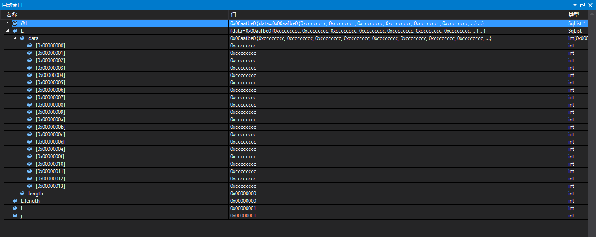
### 6. ###
按下第6次F10，开始循环执行循环体里的下面语句:

    i=ListInsert(&L,1,j);
可以看到自动输出的界面中显示L顺序表的值在开始改变。
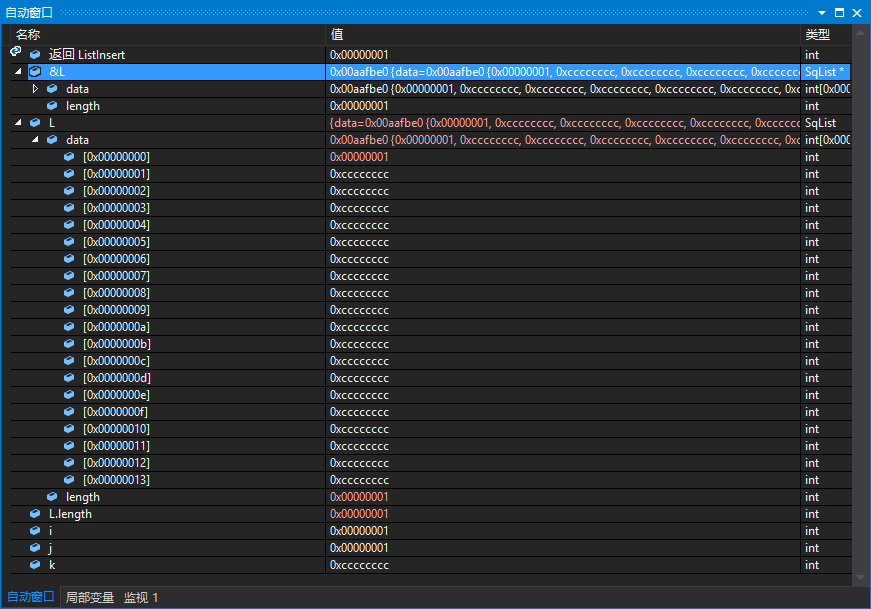
>说明，可以看到下标为0的data数组插入元素为1，同时L顺序表的长度在增加1。

### 7. ###
按下第7次F10，与上面第5次F10的显示情况一样，j的值增加1。

### 8. ###
按下第8次F10，与上面第6次F10的显示情况一样，data数组增加了元素，同时，顺序表L的长度增加1。
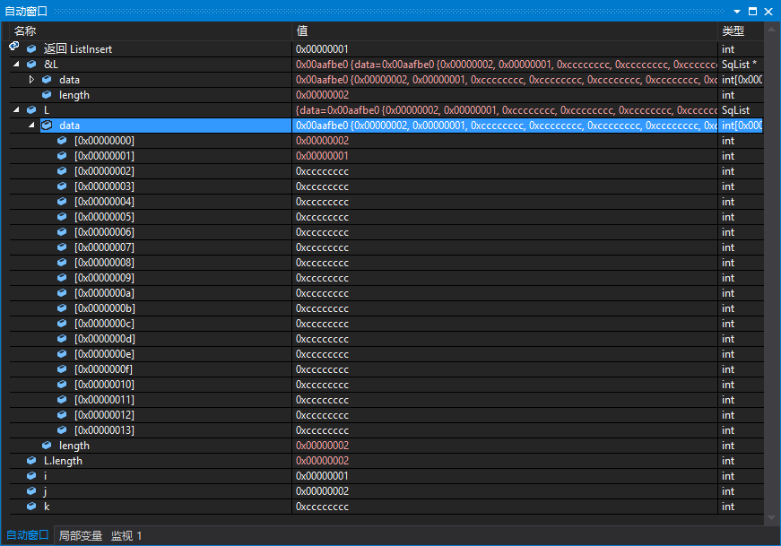

### 9. ###
按下第9次F10，与上面第5次F10的情况一样，j的值增加1.

### 10. ###
按下第10次F10，与上面第6次F10显示的情况大致相同，data数组增加了元素，同时，顺序表L的长度增加1.
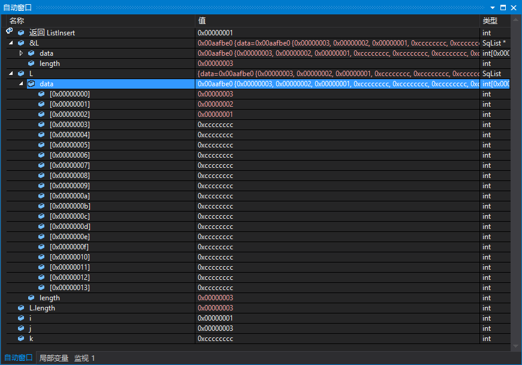

### 11. ###
按下第11次F10，与上面第5次F10的情况一样，j的值增加1.

### 12. ###
按下第12次F10，与上面第6次F10显示的情况大致相同，data数组增加了元素，同时，顺序表L的长度增加1.
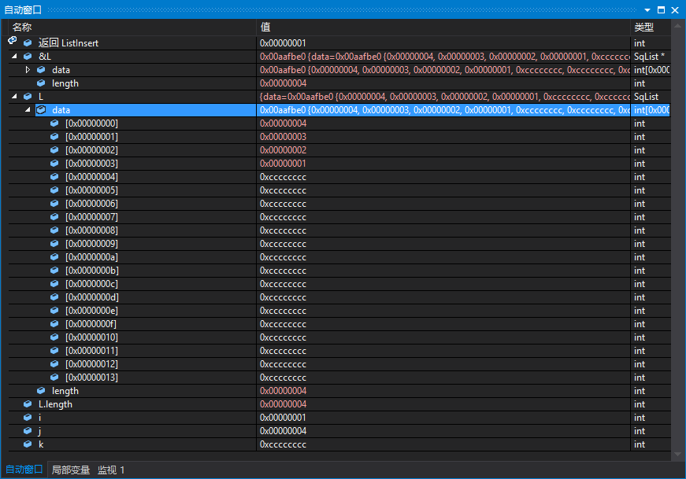

### 13. ###
按下第13次F10，与上面第5次F10的情况一样，j的值增加1.

### 14. ###
按下第14次F10，与上面第6次F10显示的情况大致相同，data数组增加了元素，同时，顺序表L的长度增加1.
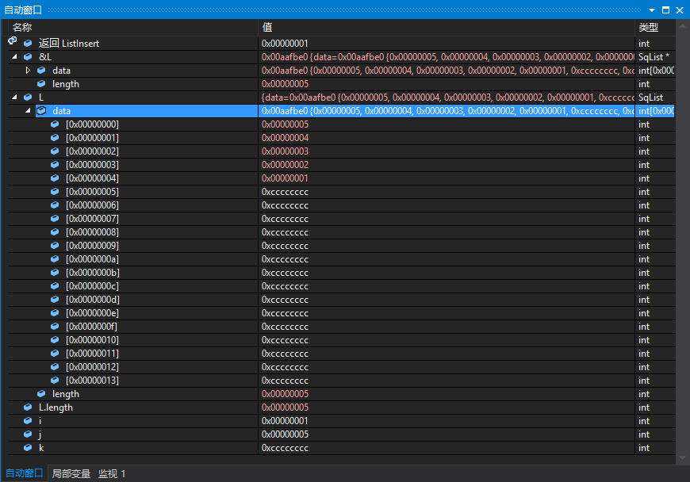

### 15. ###
按下第15次F10，与上面第5次F10的情况一样，j的值增加1.

### 16. ###
按下第16次F10，上面j的值等于6，跳出了循环，不再影响顺序表L的值了，直接输出当前L表的长度。
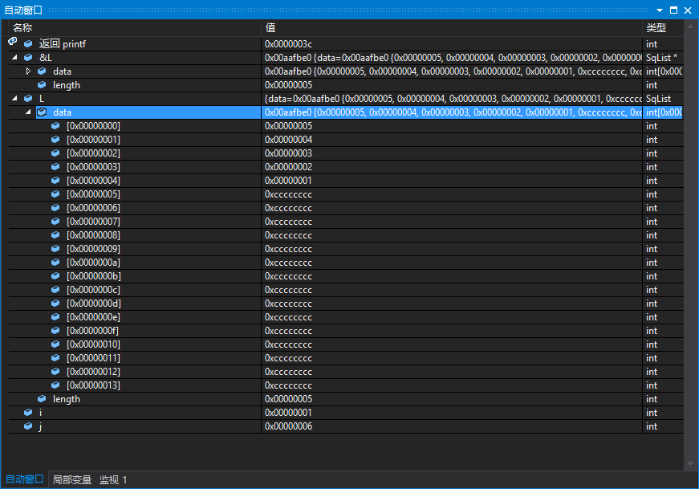

### 17. ###
按下第17次F10，执行下面的程序语句：

    ListTraverse(L); 
上面的语句执行的功能是输出L顺序表的元素值。
反映在自动输出窗口的结果如下图所示：
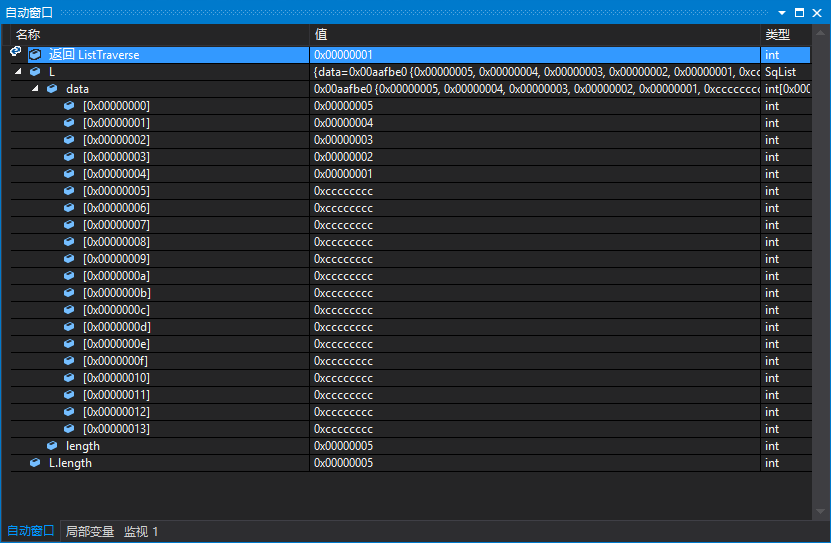

### 18. ###
按下18次F10,程序执行的语句如下所示：

    printf("L.length=%d \n",L.length);
自动输出窗口中界面的结果是：
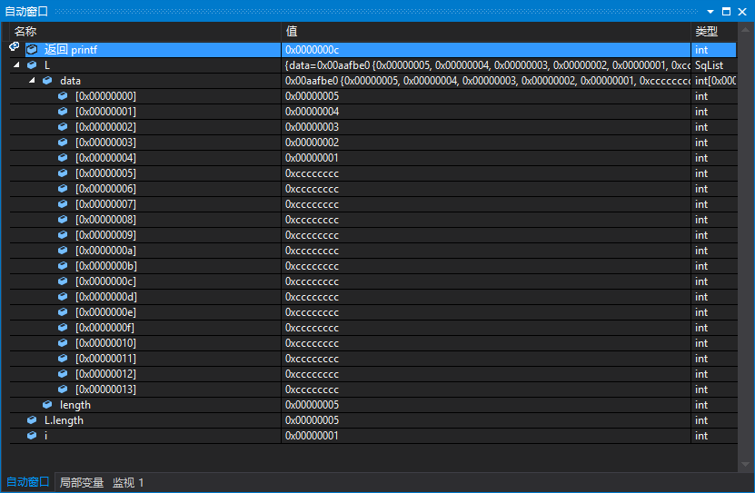

### 19. ###
按下第19次F10，程序执行的语句如下：

    i=ListEmpty(L);
自动输出窗口中界面的结果是：
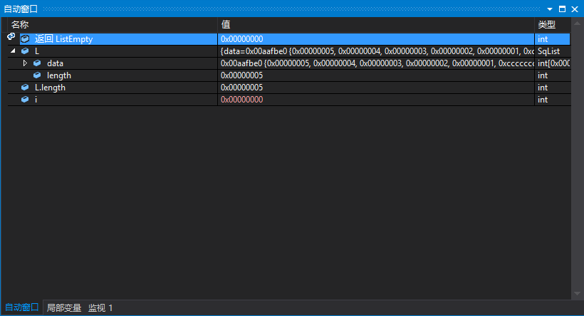

### 20. ###
按下第20次F10，程序执行的语句如下：

    printf("L is empty?: i=%d(1:Yes 0:No)\n",i);

自动输出窗口中界面的结果是：

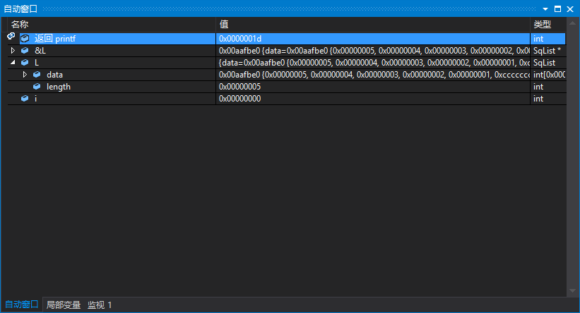

### 21. ###
按下第21次F10，程序执行的语句如下：

    i=ClearList(&L);
自动窗口中输出的界面结果如下所示：
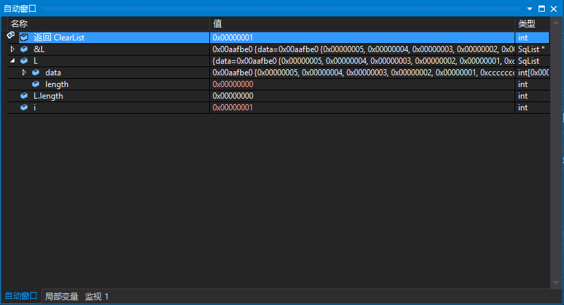

**上面的F10单步跨过程执行还能继续执行下去，但是再做下去就没有必要了，因为基本的思想已经大致掌握住即可**

## 目前解决的问题 ##
### 1. ###
有一个Warnning上的错误，应该是文本格式出现了问题。之前有一个Warning错误，是我不小心用了中问的冒号出现了错误，已经解决了。

### 2. ###
对一些函数如ListEmpty()、ListTraverse()、ClearList()等函数，在上面自动窗口中的返回值，其实本质就是在其自身内部函数中事先声明好的return值，结合自动窗口中函数返回值与function内部定义的return值对比，你就会明白。

但是，printf()函数的返回值却不是那么明显看出来的，自己在琢磨一下。
>查阅了资料，在stdio.h头文件中：int  _Cdecl printf   (const char *format, ...);可见printf()函数返回的是int型值,你也可以用sizeof函数测试这个结果。
>另外一点，printf()函数返回的是输出的字符个数。
>比如：

    int a=104;
    printf(%d",a);
    printf将返回3，
	再如：
 
    printf("123\n");
    printf将返回4
### 3. ###
Q：在顺序存储结构中，在写程序的过程中，实际上不需要指针也行吧？为什么这里需要指针？在初始化顺序线性表的时候，是初始化指针*L，这样做的意图是什么？用指针来表示顺序表，为什么不直接用定义的结构体定义顺序表呢？

A: 从内存的角度来看。对于值类型都是int、char等基本类型，当然包括结构体。这些在声明的时候就有一个向量空间，在栈里。这个大小不确定，一个结构体也可以很大。但是对于指针而言，不管什么类型的指针，其在一台机器里所需要的内存是固定的。

	i=sizeof(&L);
	printf("the length of the pointer:%d\n", i);

	j = sizeof(L);
	printf("the length of the Linear table:%d\n", j);

上面程序的输出结果是下图：
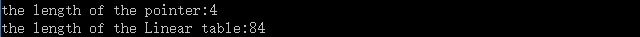
果然，很明显，在小内存的情况下，指针能够做同样多的事！！！（当然需要指针了，书本上浅显的知识未必能体会，多思考）

## 总结 ##
1. 自己调试一遍收获极大，学到了很多知识。
2. 内存与数据库。自己在用PHP开发CMS项目的时候，知道数据都是存储在MySQL数据库中的，通过phpmyadmin界面就可以对数据进行管理。PHP语句执行的效果通过在数据库中查看就可以知道是否起到了作用？从而有针对性的进行反馈调整。同样，在这里，C语言语句声明的变量都要在内存中开辟内存空间，通过Visual Studio调试就可以看到在内存中这些声明的变量的值，从而为我们调试程序提供了方便。（要清楚地知道程序中声明了哪些变量，就会有哪些内存空间，哪些程序语句会使这些变量的值发生哪些变化）
3. 写程序一定要会调试，我的调试水平还不够。