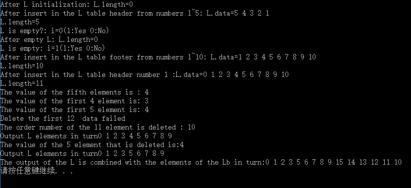
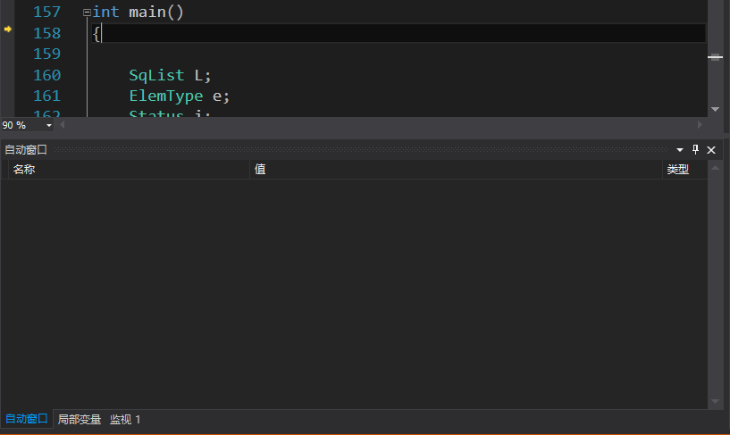
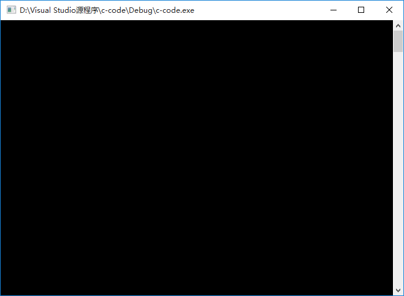
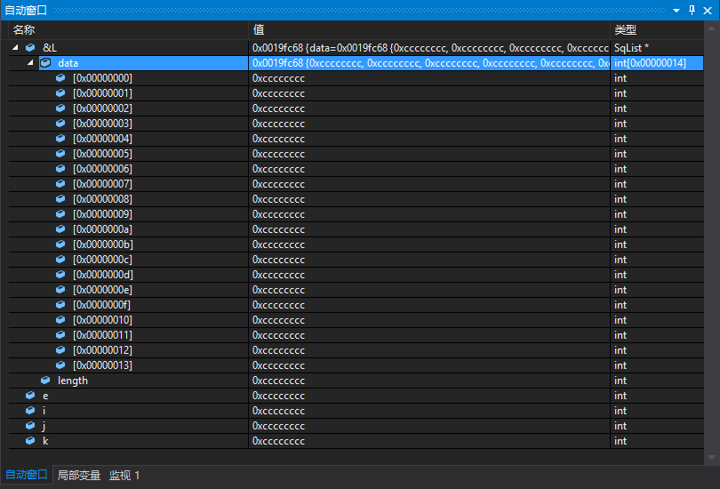
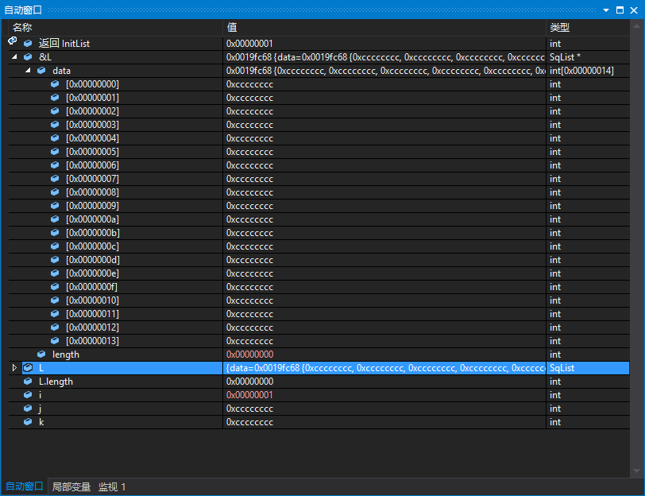
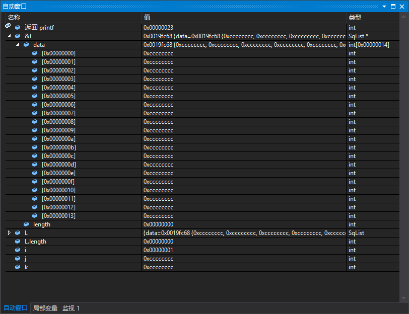
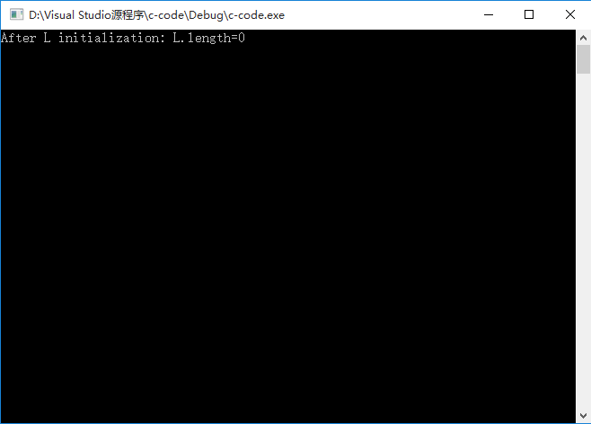
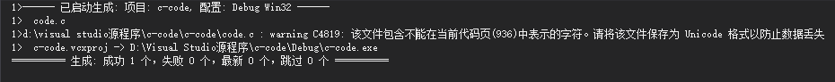

# 线性表的顺序存储结构操作 #
## 输出结果 ##

## 内存分析报告 ##
### 1. ###
按下第1次F10，单步跨过程执行，程序运行至int main()函数处，结果输出如下。

同时，可以看到CMD窗口输出空白（其实是全黑）的界面，效果输出如下：

### 2. ###
按下第2次F10，单步跨过程执行的程序如下：

    int main()
    {   
    	SqList L;
    	ElemType e;
    	Status i;
    	int j,k;
上面的声明变量语句在程序中开辟出变量的起始地址，自动窗口的输出结果如下：

>说明：这个0xcccccccc是DEBUG模式下，编译器为没有初始化的指针填充的地址值。看到很多其他的未初始化的指针都是这个值。
### 3. ###
按下第3次F10，&L生成了顺序表L，单步执行的程序如下:

    i=InitList(&L);
自动窗口的输出结果如下：

>上面红颜色的字体表示变量在刚才的语句执行中改变了。

### 4. ###
按下第4次F10，printf语句输出了L顺序表的值，单步执行的程序如下：

    printf("After L initialization: L.length=%d\n",L.length);

>说实话，对上面printf返回值是0x00000023，我也不是很明白。

另外，在CMD窗口中输出了一条语句的结果（后面不再讲解这个了，本质上都相同）

### 5. ###

## 目前存在的问题 ##
### 1. ###
有一个Warnning上的错误，应该是文本格式出现了问题。之前有一个Warning错误，是我不小心用了中问的冒号出现了错误，已经解决了。

## 总结 ##