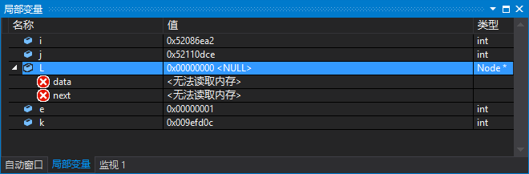
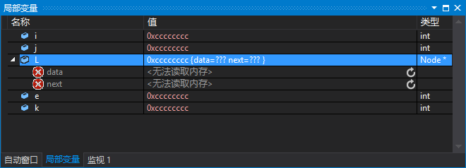
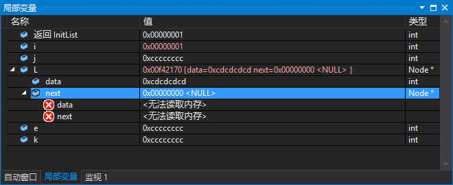
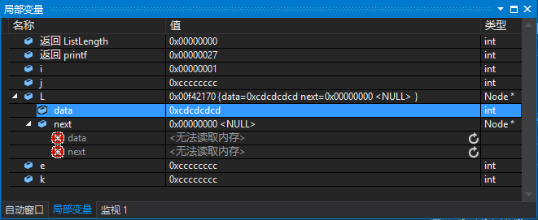
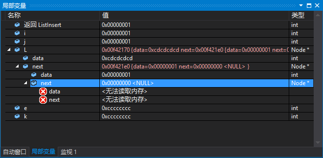
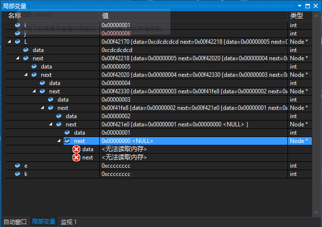
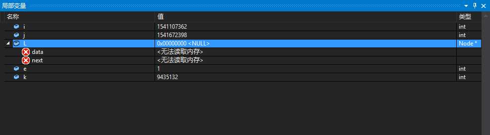

# 程序说明 #
## 调试结果 ##
### 1. ###
按下第1次F10，并没有真正地执行什么程序，看到“局部变量”窗口中显示内存中变量的值，结果显示如下：

### 2. ###
按下第2次F10，程序中变量的声明，执行的程序语句如下：

    int main() {
    	LinkList L;
    	ElemType e;
    	Status i;
    	int j, k;

可以看到调试窗口的输出结果如下:

### 3. ###
按下第3次F10，程序中是给链表初始化，执行的程序语句如下：

	i = InitList(&L);

这个函数的原型如下所示，例举出来作为显示，更加直观地看到。

    /* Initial order linear table */
    Status InitList(LinkList *L) {
    	*L = (LinkList)malloc(sizeof(Node)); /* Generates a header node, and causes the L to point to the header node */
    	if (!(*L)) /* Memory allocation failure */
    		return ERROR;
    	(*L)->next = NULL; /* Pointer field is empty */
    
    	return OK;
    }
    

在“局部变量”窗口中显示的结果如下：

### 4. ###
按下第4次F10，执行结果是返回没有被赋值的链表L的长度，执行的程序语句如下：

	printf("After initialization L:ListLength(L)=%d\n", ListLength(L));

注意一下，上面是一条语句，在“局部变量”窗口中显示的结果如下：

### 5. ###
这里要按下几次F10，向链表L中插入数据，执行的程序语句如下：

	for (j = 1; j <= 5; j++)
		i = ListInsert(&L, 1, j);

这个函数的原型如下，便于自己查看和理解。

    /* Initial condition: sequential linear table L already exists,1≤i≤ListLength(L) */
    /* Operation results: insert the new data element E, L length plus 1 before the first I position in the L. */
    Status ListInsert(LinkList *L, int i, ElemType e) {
    	int j;
    	LinkList p, s;
    	p = *L;
    	j = 1;
    	while (p && j < i) { /* Find the i-th node */
    		p = p->next;
    		++j;
    	}
    	if (!p || j>i)
    		return ERROR; /* The i-th element is not exist*/
    	s = (LinkList)malloc(sizeof(Node)); /* Create new node (C language standard function) */
    	s->data = e;
    	s->next = p->next;	/* Assign the successor node of p to the successor of s */
    	p->next = s; /* Assign s to the successor to p */
    	return OK;
    }

插入第一个数据的“局部变量”窗口中显示的结果如下所示:

等所有的数据元素插入完成之后，显示的”局部变量“窗口中的信息如下：（总共插入了6个数据，我是数了“data”的个数）

## 总结 ##
### 1 ###
2016/7/19 11:24:54-输入程序的第一遍，没有明显的错误，有一个Warning在网络上找到解答了，就解决了。但是按下F10键，想看看内存中数据中的存储方式，输出这个的结果，留待后来解决：

>2016/8/2 8:55:44 我现在才明白，上面的“局部变量”显示的结果没有错误，本来就是这样的，不是出现了错误。

