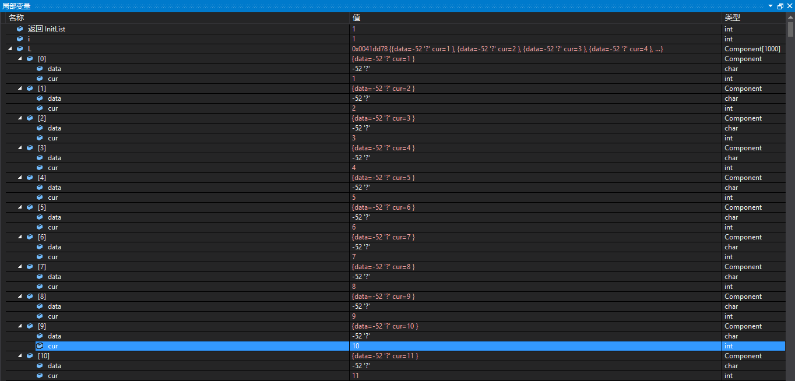

# 程序说明 #
## 1. ##
能用中文的注释，就还是用中文的注释信息，别把自己绕进去了。在Visual Studio中程序过一遍，在放到Github上，中文没有乱码。
## 2. ##
静态链表的思想是用数组代表链表，用数组描述的链表叫做静态链表。

# 调试信息 #
## 1. ##
按下1次F10，在窗口中显示出提示信息，说明程序中变量的情况。L链表的长度是非常长的，由于窗口大小有限，暂时截图如此。

## 2. ##
按下1次F10，单步执行的程序如下:

    int main() {
    	StaticLinkList L;
    	Status i;

这是申明变量的程序代码，在“局部变量”窗口中看到的提示信息是：

## 3. ##
按下1次F10，单步执行的程序如下:

	i = InitList(L);

程序的详细代码如下：

    /* 将一维数组space中各分量链成一个备用链表，space[0].cur为头指针，"0"表示空指针 */
    Status InitList(StaticLinkList space) {
    	int i;
    	for (i = 0; i<MAXSIZE - 1; i++)
    		space[i].cur = i + 1;
    	space[MAXSIZE - 1].cur = 0; /* 目前静态链表为空，最后一个元素的cur为0 */
    	return OK;
    }

这是初始化线性表L的程序代码，在“局部变量”窗口中看到的提示信息是：

## 4. ##
跳过非关键步骤，按下1次F10，单步执行的程序如下:

	i = ListInsert(L, 1, 'F');
	i = ListInsert(L, 1, 'E');
	i = ListInsert(L, 1, 'D');
	i = ListInsert(L, 1, 'B');
	i = ListInsert(L, 1, 'A');

这是向链表L中插入数据的程序代码，在“局部变量”窗口中看到的提示信息是：

## 5. ##
按下1次F10，单步执行的程序如下:

	ListTraverse(L);

函数的原型如下：

    /* 链表L的长度 */
    Status ListTraverse(StaticLinkList L) {
    	int j = 0;
    	int i = L[MAXSIZE - 1].cur;
    	while (i) {
    		visit(L[i].data);
    		i = L[i].cur;
    		j++;
    	}
    	return j;
    	printf("\n");
    	return OK;
    }

这是求链表L的程序代码，在“局部变量”窗口中看到的提示信息是：

## 6. ##
在执行了下面的程序语句之后：

	i = ListInsert(L, 3, 'C');
	printf("\n在L的“B”与“D”之间插入“C”后：\nL.data=");

再次执行F10，单步执行下面的程序：

	ListTraverse(L);

在“局部变量”窗口中查看提示信息：

## 7. ##
在执行了下面的程序语句之后：

	i = ListDelete(L, 1);
	printf("\n在L的删除“A”后：\nL.data=");

再次执行F10，单步执行下面的程序：

	ListTraverse(L);

在“局部变量”窗口中查看提示信息：

# 总结 #
今天调试这里真的是特别地快，好多的东西都是调试过的，学过的，没什么难度，很快就完成了。

F10和F11相互结合，能够看到程序在内存中的所有情况，确实是好方法，什么变化情况都能看清楚。