# 调试信息 #
对顺序栈进行调试!
## 1. ##
按下1次F10，显示出程序开辟的变量内存信息.

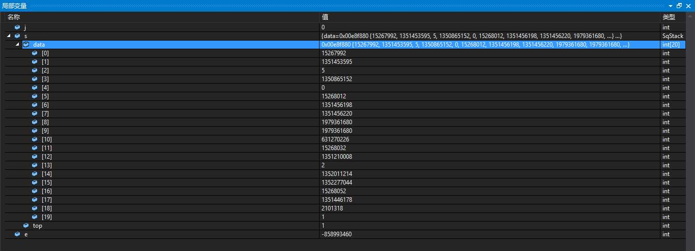

## 2. ##
按下1次F10，执行的程序语句如下：

    int main() {
    	int j;
    	SqStack s;
    	int e;

在“局部变量”窗口中显示的内存信息如下：

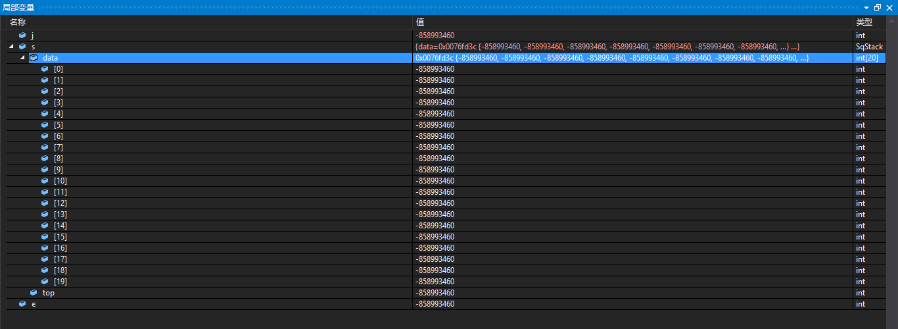

## 3. ##
在这个步骤中，将循环执行如下程序：

	if (InitStack(&s) == OK)
		for (j = 1; j <= 10; j++)
			Push(&s, j);

程序的目的是向内存中插入数据，最开始的情况如下所示：

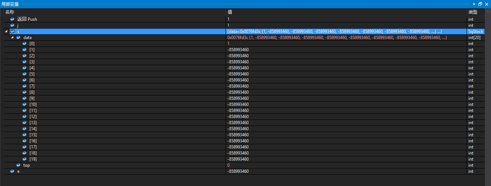

插入完成之后，在内存中的信息如下：

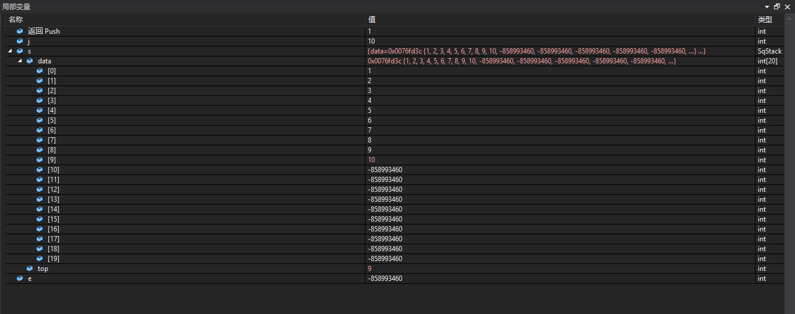

## 4. ##
这一步骤执行的程序语句如下：

	StackTraverse(s);

从栈底对栈顶依次对栈中的数据元素显示，返回结果是1，在“局部变量”窗口中的提示信息如下：

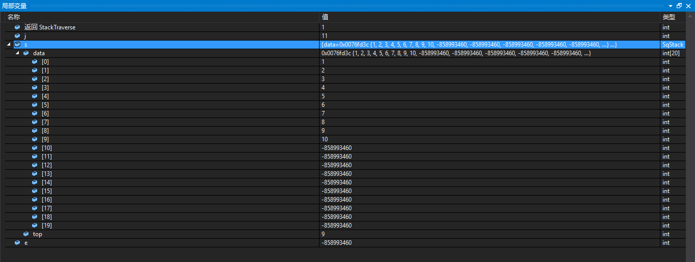

## 5. ##
这一步骤执行了程序语句如下

	printf("栈空否：%d(1:空 0:否)\n", StackEmpty(s));

可以看到在“局部变量”窗口中提示的信息如下：

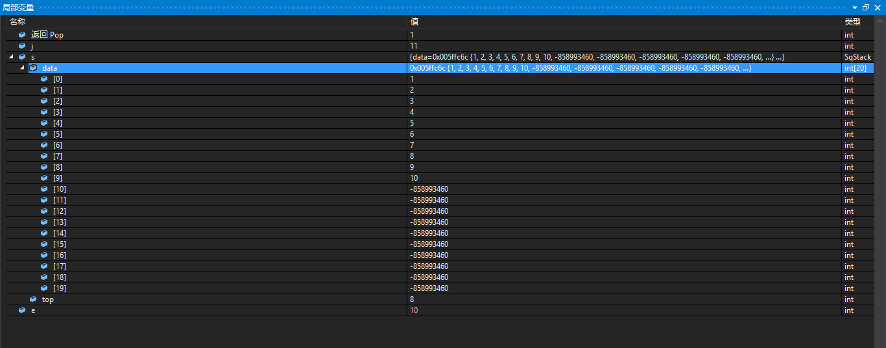

## 6. ##
按下1次F10，执行的程序语句如下：

	GetTop(s, &e);

在“局部变量”窗口中提示的信息如下：

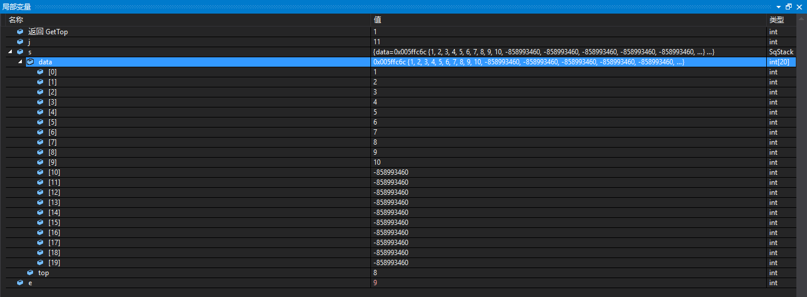

## 7. ##

按下1次F10，执行的程序语句如下：

```
	printf("栈顶元素 e=%d 栈的长度为%d\n", e, StackLength(s));
```

在“局部变量”窗口中看到的提示信息如下:

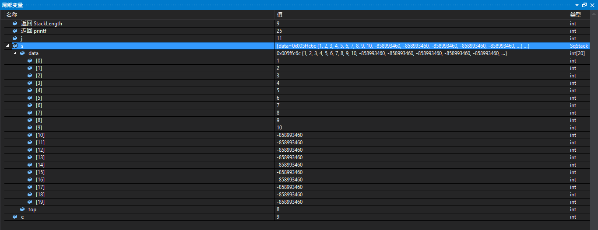

## 8.

按下1次F10，这一步骤执行的程序语句如下：

```
ClearStack(&s);
```

在“局部变量”窗口中看到的内存信息如下：

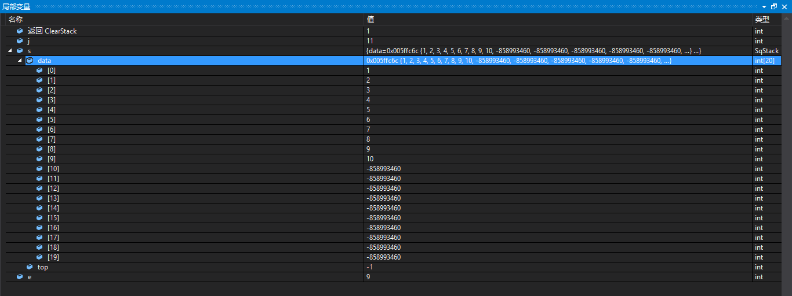

> 这里说明一个情况，在每次的调试过程中，有不少操作都是删掉元素的，但是在内存中没有看到数据元素的减少，数据元素的格式纹丝未动，这是怎么回事？
>
> 应该都是用指针操作，没有影响到内存中的实际信息吧！！！

## 9.

按下1次F10，这个步骤执行的程序语句如下：

```
printf("清空栈后，栈空否：%d(1:空 0:否)\n", StackEmpty(s));
```

在“局部变量”窗口中的提示信息如下:

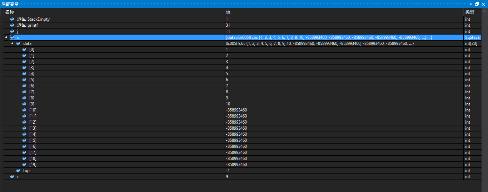

在CMD窗口中的提示信息如下：

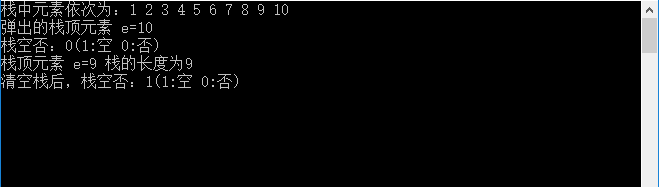

------


**至此算是结束了！！**

# 总结 #

这里的总结，就用我对这个问题的说明：

> 这里说明一个情况，在每次的调试过程中，有不少操作都是删掉元素的，但是在内存中没有看到数据元素的减少，数据元素的格式纹丝未动，这是怎么回事？
>
> 应该都是用指针操作，没有影响到内存中的实际信息吧！！！