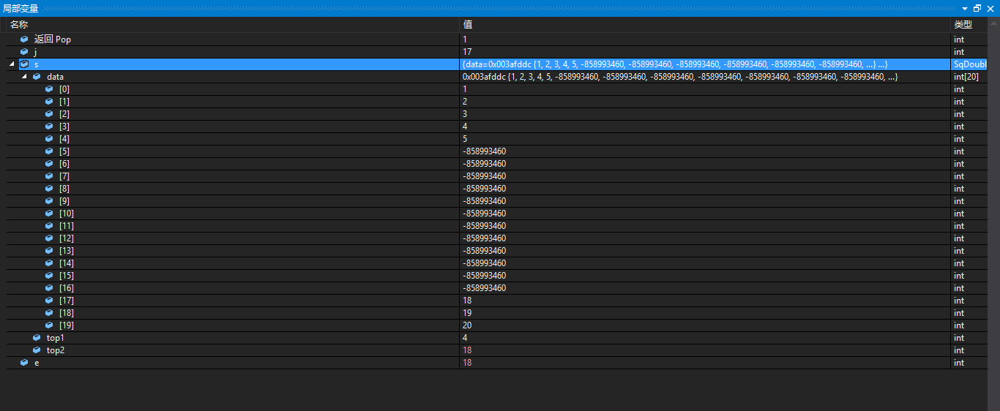

# 调试信息

## 1.

第一次按下F10，在“局部变量”窗口中显示出程序的变量信息：


## 2.

按下第2次F10，执行的程序语句如下：

```
int main() {
	int j;
	SqDoubleStack s;
	int e;
```

在“局部变量”窗口中看到的内存信息如下：


## 3.

按下一次F10，在程序中执行的程序语句如下：

```
	if (InitStack(&s) == OK) {
		for (j = 1; j <= 5; j++)
			Push(&s, j, 1);
		for (j = MAXSIZE; j >= MAXSIZE - 2; j--)
			Push(&s, j, 2);
	}
```

上面的程序的作用是在栈的两头将数据插入栈中，要连续按下多次F10，可看到内存中数据入栈，最终的结果如下所示：


## 4.

按下一次F10，执行的程序语句如下:

```
	StackTraverse(s);
```

上面的程序语句的作用是:从栈底对栈顶依次对栈中的每个数据元素显示

在“局部变量”窗口中看到的提示信息如下：


在“CMD窗口”中看到提示信息如下:


## 5.

按下1次F10，执行的程序语句如下：

```
	printf("当前栈中元素有：%d \n", StackLength(s));
```

在“局部变量”窗口中看到的提示信息如下：


## 6.

按下1次F10，执行的程序语句如下：

```
	Pop(&s, &e, 2);
```

上面程序语句的作用是：若栈不空，则删除S的栈顶元素，用e返回其值，并返回OK；否则返回ERROR .

在“局部变量”窗口中看到的提示信息如下：



## 7.

跳过一些步骤，执行的程序语句如下：

```
	printf("栈空否：%d(1:空 0:否)\n", StackEmpty(s));
```

在“局部变量”窗口中看到的提示信息如下：


## 8.

按下1次F10，执行的程序语句如下：

```
	for (j = 6; j <= MAXSIZE - 2; j++)
		Push(&s, j, 1);
```

上面的程序语句的作用是：元素出栈。最终在“局部变量”窗口中看到的提示信息如下：


## 9.

按下1次F10，执行的程序语句如下：

```
	StackTraverse(s);
```

在“CMD窗口”中看到的提示信息如下：


## 10.

按下1次F10，执行的程序语句如下：

```
	printf("栈满否：%d(1:否 0:满)\n", Push(&s, 100, 1));
```

在“局部变量”窗口中看到的提示信息如下：


在“CMD窗口”中看到的提示信息如下：


## 11.

按下1次F10,执行的程序语句如下：

```
	ClearStack(&s);
```

在“局部变量”窗口中看到的提示信息如下;


## 12.

按下1次F10,执行的程序语句如下：

```
	printf("清空栈后，栈空否：%d(1:空 0:否)\n", StackEmpty(s));
```

在“局部变量”窗口中看到的提示信息如下：


在“CMD窗口”中看到的提示信息如下：


------

至此，算是调试结束！

# 总结

在“内存”当中，栈的元素自从插入之后，就几乎没有什么变化，从来都是插入之后就不再改变了，那么那些数据被删除了，栈又清空了，是怎么回事？？