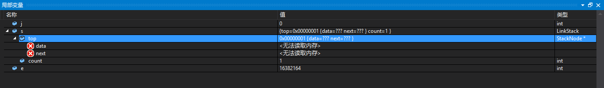
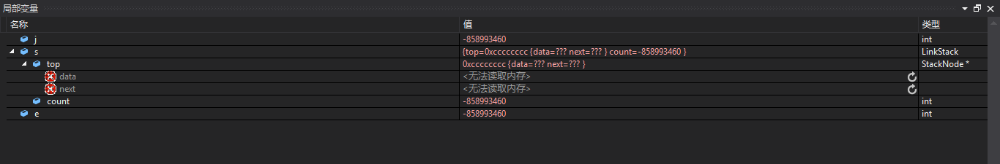
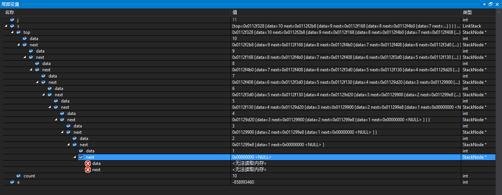
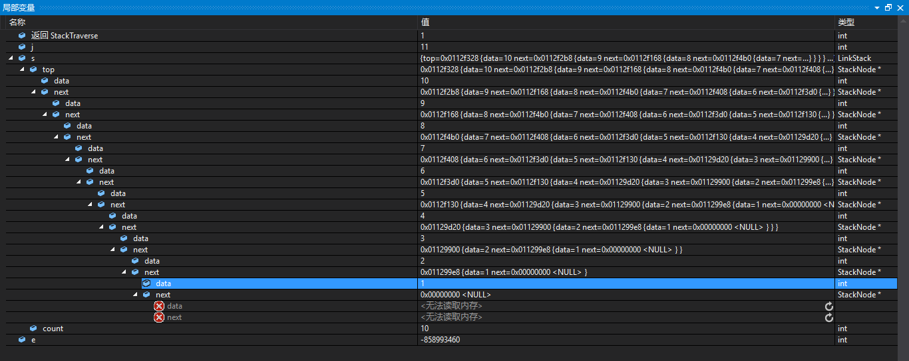
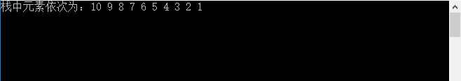
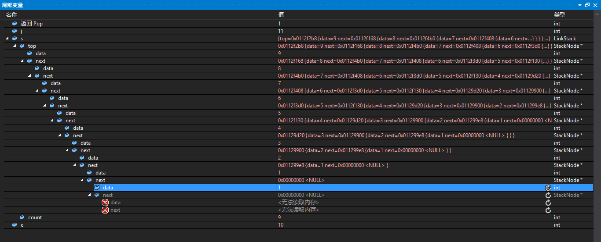
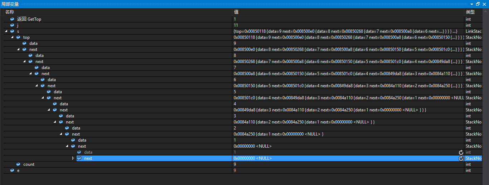
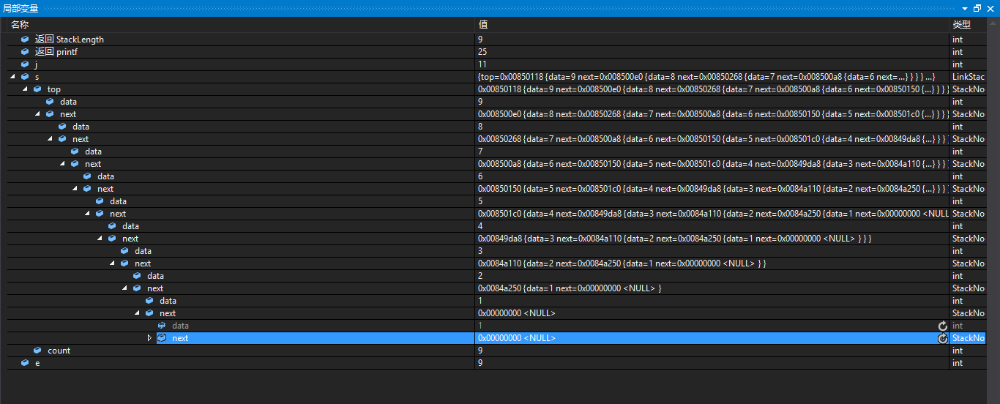
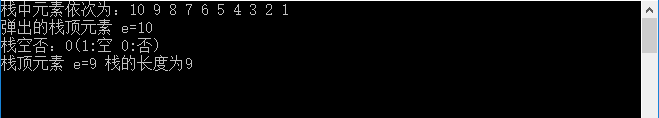
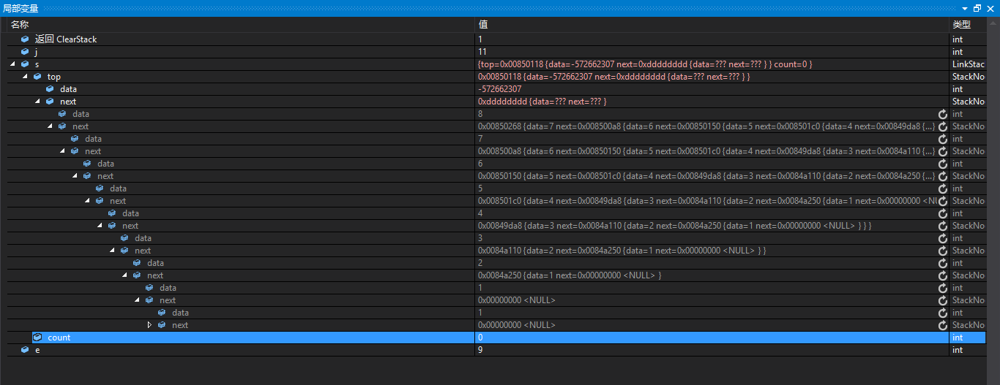

# 调试信息

## 1.

按下第1次F10，显示出程序的变量信息，此时还没有对变量声明，在“局部变量”窗口中可以看到的信息如下：



## 2.

按下第2次F10，程序执行的语句如下：

```
int main() {
	int j;
	LinkStack s;
	int e;
```

在“局部变量”窗口中可以看到的结果如下：



## 3.

接下来的单步调试F10过程中，执行的程序语句如下:

```
if (InitStack(&s) == OK)
		for (j = 1; j <= 10; j++)
			Push(&s, j);
```

上面程序语句的作用是将数据元素入栈，可以看到所有数据元素都进入栈的情况下，在“局部变量”窗口中看到的结果信息如下：



在这里补充说明一下，Push函数的原型，其用到了malloc()函数开辟内存。

```
/* 插入元素e为新的栈顶元素 */
Status Push(LinkStack *S, SElemType e) {
	LinkStackPtr s = (LinkStackPtr)malloc(sizeof(StackNode));
	s->data = e;
	s->next = S->top;	/* 把当前的栈顶元素赋值给新结点的直接后继，见图中① */
	S->top = s;         /* 将新的结点s赋值给栈顶指针，见图中② */
	S->count++;
	return OK;
}
```

## 4.

下面的一个过程执行的程序语句如下：

```
	printf("栈中元素依次为：");
	StackTraverse(s);
```

在“局部变量”窗口中看到上面两个函数的返回信息，结果如下;



在CMD窗口中可以看到的提示信息如下：



## 5.

按下F10，这一步执行的程序语句如下：

```
	Pop(&s, &e);
```

上面程序语句的函数的原型是：

```
/* 若栈不空，则删除S的栈顶元素，用e返回其值，并返回OK；否则返回ERROR */
Status Pop(LinkStack *S, SElemType *e) {
	LinkStackPtr p;
	if (StackEmpty(*S))
		return ERROR;
	*e = S->top->data;
	p = S->top;					/* 将栈顶结点赋值给p，见图中③ */
	S->top = S->top->next;    /* 使得栈顶指针下移一位，指向后一结点，见图中④ */
	free(p);                    /* 释放结点p */
	S->count--;
	return OK;
}
```

在“局部变量”窗口中看到的提示信息如下：



> 看下这里，数据是实实在在地减少了，与顺序栈完全不同，思考一下是怎么回事？？

## 6.

按下一次F10，在程序中单步调试的程序是：

```
	GetTop(s, &e);
```

该函数的原型是：

```
/* 若栈不空，则用e返回S的栈顶元素，并返回OK；否则返回ERROR */
Status GetTop(LinkStack S, SElemType *e) {
	if (S.top == NULL)
		return ERROR;
	else
		*e = S.top->data;
	return OK;
}
```

可以在“局部变量”窗口中看到提示信息：



## 7.

按下1次F10，执行的程序代码如下：

```
	printf("栈顶元素 e=%d 栈的长度为%d\n", e, StackLength(s));
```

可以在“局部变量”窗口中看到的提示信息如下：



在“CMD”窗口中看到的提示信息如下：



## 8.

按下1次F10，执行的程序是：

```
	ClearStack(&s);
```

函数原型是：

```
/* 把S置为空栈 */
Status ClearStack(LinkStack *S) {
	LinkStackPtr p, q;
	p = S->top;
	while (p) {
		q = p;
		p = p->next;
		free(q);
	}
	S->count = 0;
	return OK;
}
```

在“局部变量”窗口中看到的提示信息如下：



可以看到在链表中的数据被清空了。

# 总结

这里的总结是一个问题，链栈程序当中数据是实实在在地减少了，与顺序栈完全不同，思考一下是怎么回事？？

