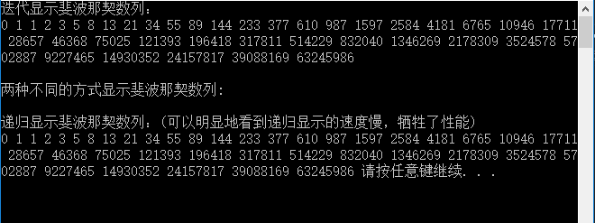

# 运行结果

最终的运行界面结果截图(CMD窗口)，可以明显地看到递归方式的速度比较慢。



# 调试结果

## 1.

按下1次F10，在程序执行之处，编辑器知道程序中的变量的值，在“局部变量”窗口中可以看到的提示信息如下（2个图，电脑屏幕小了）


## 2.

按下1次F10,执行的程序语句是：

```
int main() {
	int i;
	int a[40];
```

上面的程序的作用是声明变量，在“局部变量”窗口中将会看到提示信息如下：


## 3.

按下一次F10 ，执行的程序语句如下：

```
	printf("迭代显示斐波那契数列：\n");
	a[0] = 0;
	a[1] = 1;
	printf("%d ", a[0]);
	printf("%d ", a[1]);
```

上面都是非常简单的程序语句，可以清楚地看到在“局部变量”窗口中的变化，结果如下所示：


## 4.

按下几次F10，跳过一些非关键步骤，执行的是下面的程序语句：

```
	for (i = 2; i < 40; i++) {
		a[i] = a[i - 1] + a[i - 2];
		printf("%d ", a[i]);
	}
```

在第一次内存中发生变化的时候，可以看到"局部变量"窗口中提示的结果如下：


这个程序比较简单，可以清晰地在“脑海”中脑补内存中变量的变化情况，最终的“局部变量“窗口中提示的结果如下：

图1


附图1


## 5.

跳过一些printf()语句，直接执行到下面的程序语句，递归函数。

```
	for (i = 0; i < 40; i++)
		printf("%d ", Fbi(i));
```

函数的原型是：

```
int Fbi(int i)  /* 斐波那契的递归函数 */
{
	if (i < 2)
		return i == 0 ? 0 : 1;
	return Fbi(i - 1) + Fbi(i - 2);  /* 这里Fbi就是函数自己，等于在调用自己 */
}
```

下面这一步骤，比较特殊了，不用F10单步调试了，看不清楚关键的结果，要用F11单步调试了，自己调试一遍你就会明白为什么递归调用比迭代调用速度慢了，因为递归调用运行的程序语句更多，通过自己调试就能看出来。

这里是用return 语句返回值的，不是用printf()


# 总结


# 