# 运行结果

运行结果在一个屏幕下面都看不完，下面是最主要部分的CMD调试结果，如下图所示：

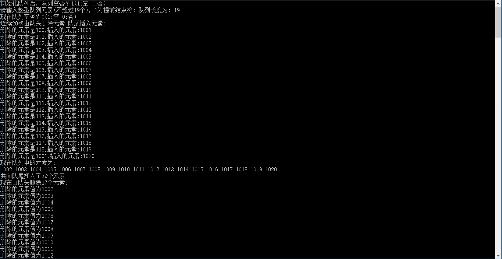

# 调试信息

## 1.

按下1次F10，编辑器在程序中的变量还未申明之前，就事先在内存中开辟了变量空间，在“局部变量”窗口中查看的结果如下：

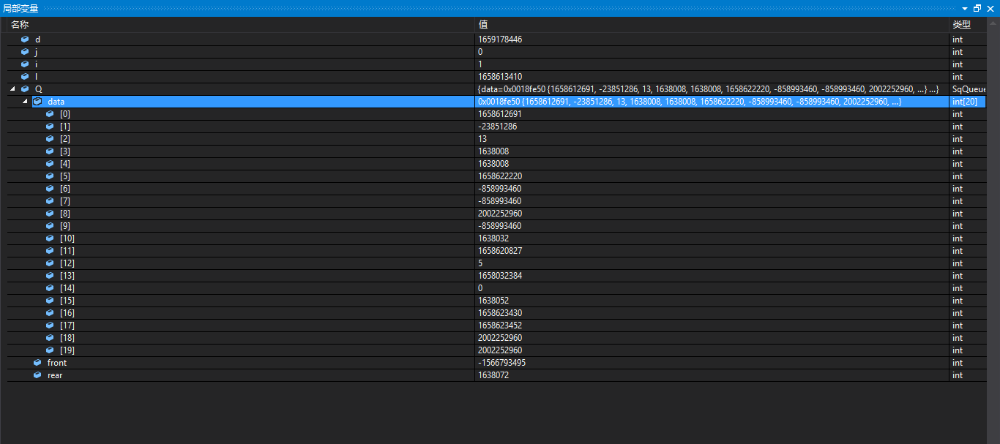

## 2.

按下1次F10,程序中申明了变量，执行了如下的程序：

```
int main() {
	Status j;
	int i = 0, l;
	QElemType d;
	SqQueue Q;
```

在“局部变量”窗口中可以看到的提示信息如下：

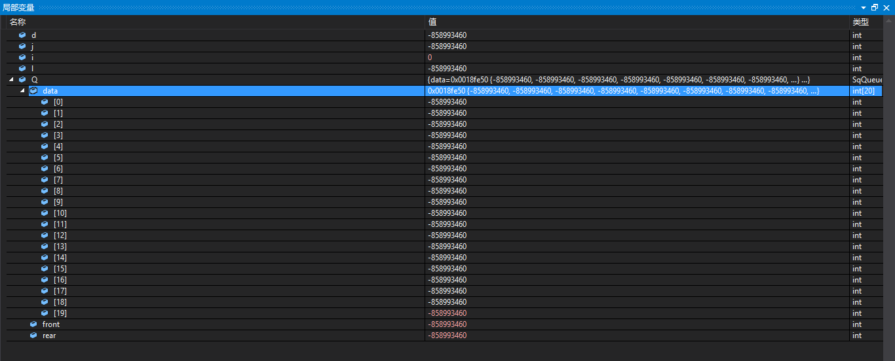

## 3.

按下1次F10，执行的程序如下：

```
	InitQueue(&Q);
```

这个函数的原型如下：

```
/* 初始化一个空队列Q */
Status InitQueue(SqQueue *Q) {
	Q->front = 0;
	Q->rear = 0;
	return  OK;
}
```

由上面的函数原型，可以明显地知道在“局部变量”窗口中内存的变化情况如下：

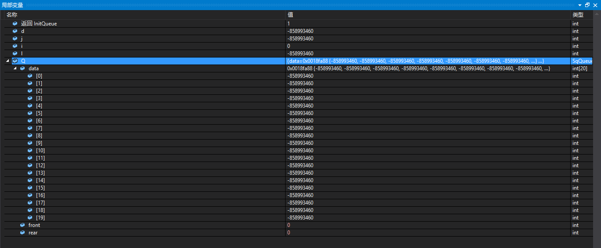

## 4.

按下1次F10，执行的程序语句如下：

```
	printf("初始化队列后，队列空否？%u(1:空 0:否)\n", QueueEmpty(Q));
```

这个函数的原型如下：

```
/* 若队列Q为空队列,则返回TRUE,否则返回FALSE */
Status QueueEmpty(SqQueue Q) {
	if (Q.front == Q.rear) /* 队列空的标志 */
		return TRUE;
	else
		return FALSE;
}
```

猜测在“局部变量”窗口中的返回值为TRUE，结果如下：

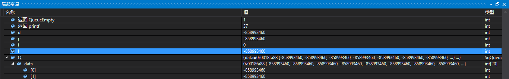

## 5.

跳过非关键步骤，按下1次F10，执行的程序语句如下：

```
	do {
		/* scanf("%d",&d); */
		d = i + 100;
		if (d == -1)
			break;
		i++;
		EnQueue(&Q, d);
	} while (i<MAXSIZE - 1);
```

上面语句的作用是执行循环，在队列中插入元素。

上面用到的函数原型是：

```
/* 若队列未满，则插入元素e为Q新的队尾元素 */
Status EnQueue(SqQueue *Q, QElemType e) {
	if ((Q->rear + 1) % MAXSIZE == Q->front)	/* 队列满的判断 */
		return ERROR;
	Q->data[Q->rear] = e;			/* 将元素e赋值给队尾 */
	Q->rear = (Q->rear + 1) % MAXSIZE;/* rear指针向后移一位置， */
									  /* 若到最后则转到数组头部 */
	return  OK;
}
```

------

这次的程序调试比较特殊，基本上重头戏在后面的“总结”部分。

# 总结

## 1.

虽然小甲鱼的视频大多数都是抄的，但是在循环队列这里讲解地比较好，很值得一看，很快就会明白循环队列的作用。

## 2.

关于这里为什么有点复杂，自己一开始就没有太明白，程序是如何处理的？

答：因为自己最初对这个程序的用法和设置不太明白。这个队列应该是顺序循环队列，其结构体如下：

```
typedef int QElemType; /* QElemType类型根据实际情况而定，这里假设为int */

typedef struct {
	QElemType data[MAXSIZE];
	int front;    	/* 头指针 */
	int rear;		/* 尾指针，若队列不空，指向队列尾元素的下一个位置 */
}SqQueue;
```

在后面的程序中比较复杂，自己要多画画图才能明白的。

### 1.

在程序初始化的时候，内存中的情况如下图所示：


### 2.

插入第一个数据100之后，内存中的情况如下：

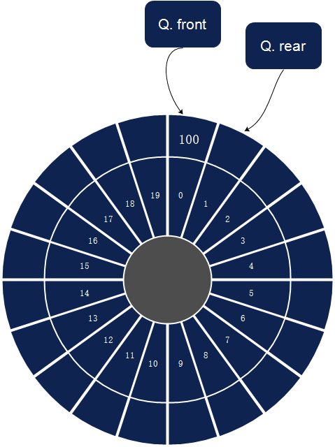

### 3.

插入第2个数据101之后，在内存中的情况如下：

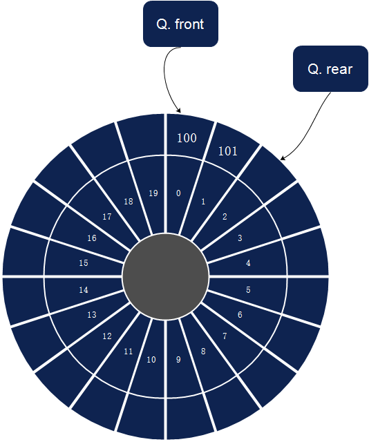

### 4.

在以下程序执行完之后，在内存中的变量情况如下图所示：

```
do {
		/* scanf("%d",&d); */
		d = i + 100;
		if (d == -1)
			break;
		i++;
		EnQueue(&Q, d);
	} while (i<MAXSIZE - 1);
```

这是在最终临界点的图片：

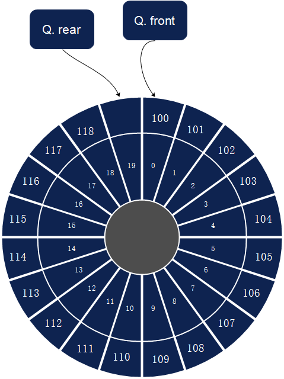

### 5.

在上面第4步骤的临界点，按下F10之后，进入到下面的状态。

在循环之中，执行了下面的函数：

```
		DeQueue(&Q, &d);
```

函数原型如下：

```
/* 若队列不空，则删除Q中队头元素，用e返回其值 */
Status DeQueue(SqQueue *Q, QElemType *e) {
	if (Q->front == Q->rear)			/* 队列空的判断 */
		return ERROR;
	*e = Q->data[Q->front];				/* 将队头元素赋值给e */
	Q->front = (Q->front + 1) % MAXSIZE;	/* front指针向后移一位置， */
											/* 若到最后则转到数组头部 */
	return  OK;
}
```

可以观察到图形的变化如下：

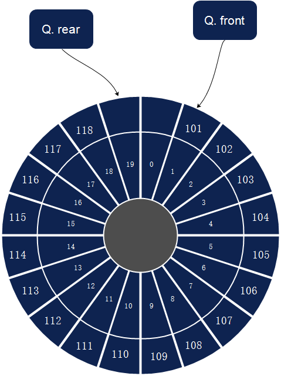


但是，在内存之中，这里data[0]的元素是没有删除的，证明的图形如下：


### 6.

之后的大量步骤就是执行下面的循环

```
for (l = 1; l <= MAXSIZE; l++) {
		DeQueue(&Q, &d);
		printf("删除的元素是%d,插入的元素:%d \n", d, l + 1000);
		/* scanf("%d",&d); */
		d = l + 1000;
		EnQueue(&Q, d);
	}
```

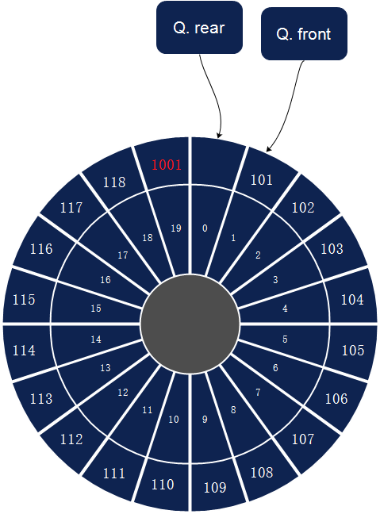


### 7.

再插入一个数据-1002-之后，在内存中的变量情况如下所示：

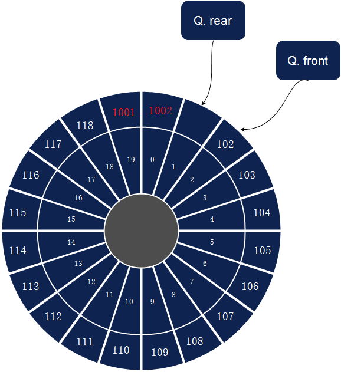


> 现在我才知道这里一定要画图，你不画图时根本就不会想明白的。

### 8.

再按下1个F10,插入的数据1003，在内存中的情况如下：

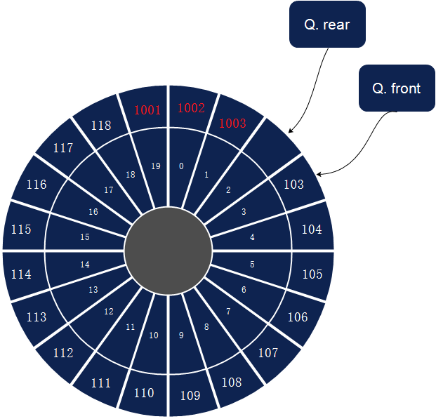

我可能忽略了一点，在内存中的情况，可以通过“局部变量”窗口来看到，”局部变量“窗口与“上面我画的图”结合在一起，最好地理解了。

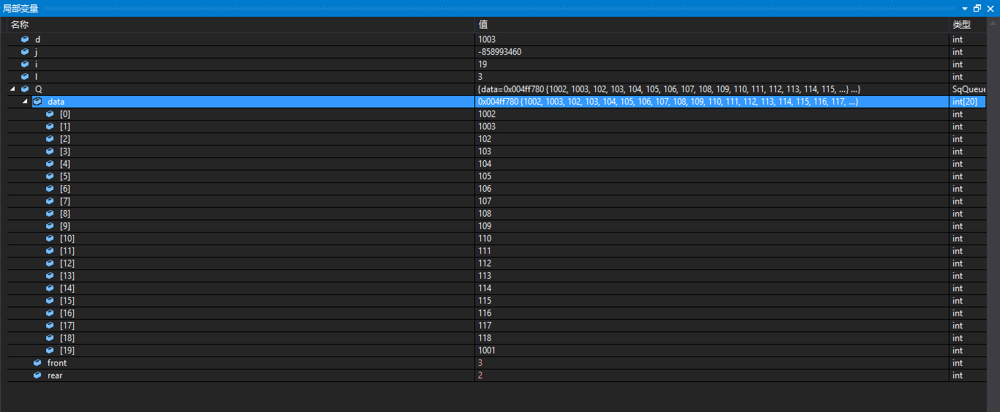

> 可以明显地看到标志Q.front与标志Q.rear，一个跑，一个在后面追

### 9.

到某个中间阶段插入大量的数据，在内存中的情况如下：

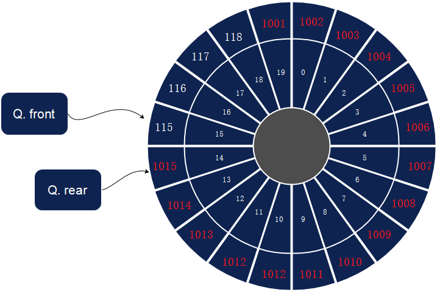

------

基本上到这里算是对程序，理解比较深刻了，C语言中用取模运算构成了一个环形的逻辑结构，在实际的存储结构中，是连续的数组构成的顺序表。