# 运行结果 #
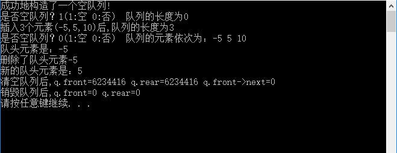

# 调试信息 #
## 1. ##
按下1次F10，先探明程序中变量的内存信息，此时的值是随意分配的。在“局部变量”窗口中看到的结果如下:

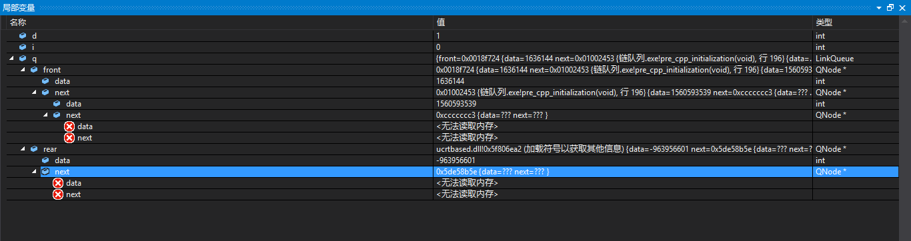

## 2. ##
按下第2次F10，执行的程序如下：

    int main() {
    	int i;
    	QElemType d;
    	LinkQueue q;

在“局部变量”窗口中看到的提示信息如下：

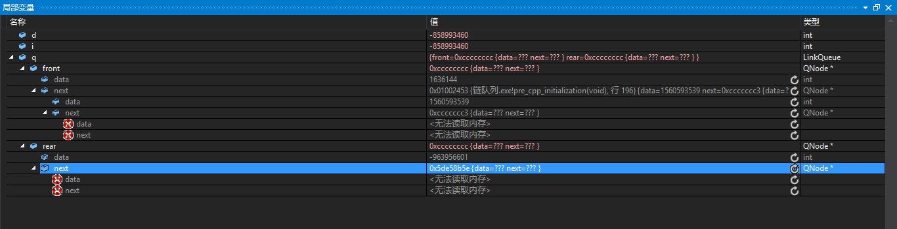

## 3. ##
按下1次F10，执行的程序如下：

	i = InitQueue(&q);

初始化队列，这个函数的原型如下:

    /* 构造一个空队列Q */
    Status InitQueue(LinkQueue *Q) {
    	Q->front = Q->rear = (QueuePtr)malloc(sizeof(QNode));
    	if (!Q->front)
    		exit(OVERFLOW);
    	Q->front->next = NULL;
    	return OK;
    }

在“局部变量”窗口中看到的提示信息如下;

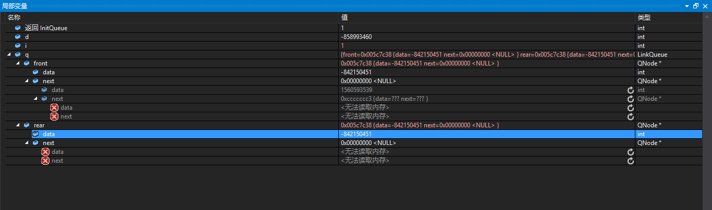

## 4. ##
跳过一些非关键步骤，按下F10，执行的程序如下：

	EnQueue(&q, -5);
	EnQueue(&q, 5);
	EnQueue(&q, 10);

向队列中插入，-5，5，10这三个数据，这个函数的原型如下;

    /* 插入元素e为Q的新的队尾元素 */
    Status EnQueue(LinkQueue *Q, QElemType e) {
    	QueuePtr s = (QueuePtr)malloc(sizeof(QNode));
    	if (!s) /* 存储分配失败 */
    		exit(OVERFLOW);
    	s->data = e;
    	s->next = NULL;
    	Q->rear->next = s;	/* 把拥有元素e的新结点s赋值给原队尾结点的后继，见图中① */
    	Q->rear = s;		/* 把当前的s设置为队尾结点，rear指向s，见图中② */
    	return OK;
    }

在“局部变量”窗口中看到的提示信息如下：

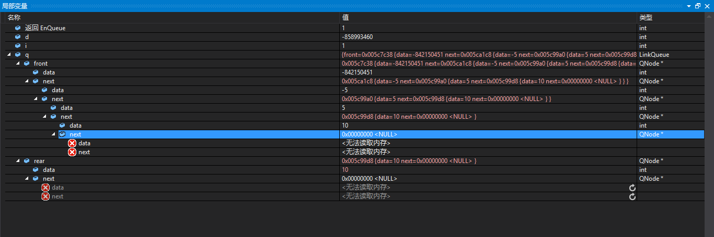

## 5. ##
跳过一些非关键步骤，按下F10，执行的程序如下：

	i = GetHead(q, &d);

这个函数的原型如下：

    /* 若队列不空,则用e返回Q的队头元素,并返回OK,否则返回ERROR */
    Status GetHead(LinkQueue Q, QElemType *e) {
    	QueuePtr p;
    	if (Q.front == Q.rear)
    		return ERROR;
    	p = Q.front->next;
    	*e = p->data;
    	return OK;
    }

在“局部变量”窗口中提示的信息如下：

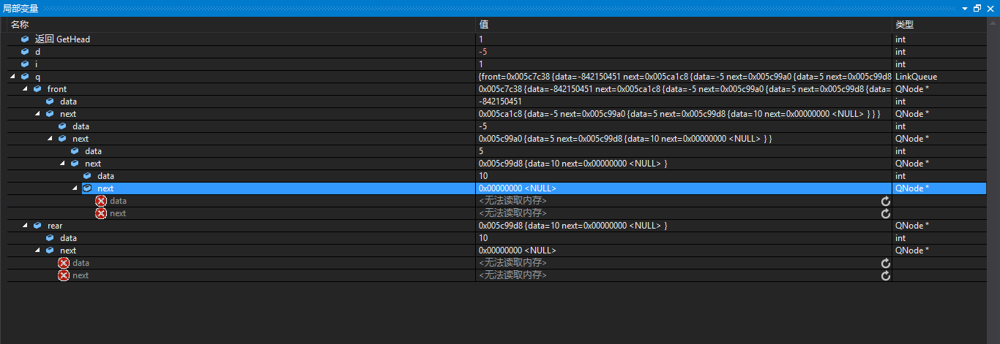

## 6. ##
执行下一个重要的程序语句：

	DeQueue(&q, &d);

这个函数的原型是：

    /* 若队列不空,删除Q的队头元素,用e返回其值,并返回OK,否则返回ERROR */
    Status DeQueue(LinkQueue *Q, QElemType *e) {
    	QueuePtr p;
    	if (Q->front == Q->rear)
    		return ERROR;
    	p = Q->front->next;		/* 将欲删除的队头结点暂存给p，见图中① */
    	*e = p->data;				/* 将欲删除的队头结点的值赋值给e */
    	Q->front->next = p->next;/* 将原队头结点的后继p->next赋值给头结点后继，见图中② */
    	if (Q->rear == p)		/* 若队头就是队尾，则删除后将rear指向头结点，见图中③ */
    		Q->rear = Q->front;
    	free(p);
    	return OK;
    }

在“局部变量”窗口中看到的提示信息如下：

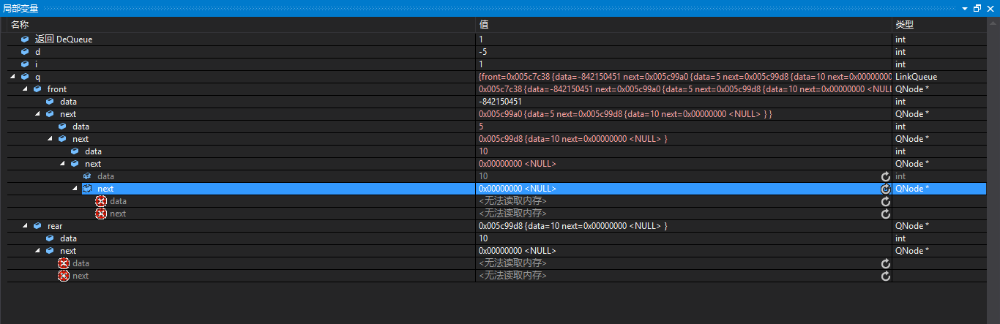

## 7. ##
执行下列程序语句：

	i = GetHead(q, &d);

获取新的头部元素，在“局部变量”窗口中查看到的信息如下：

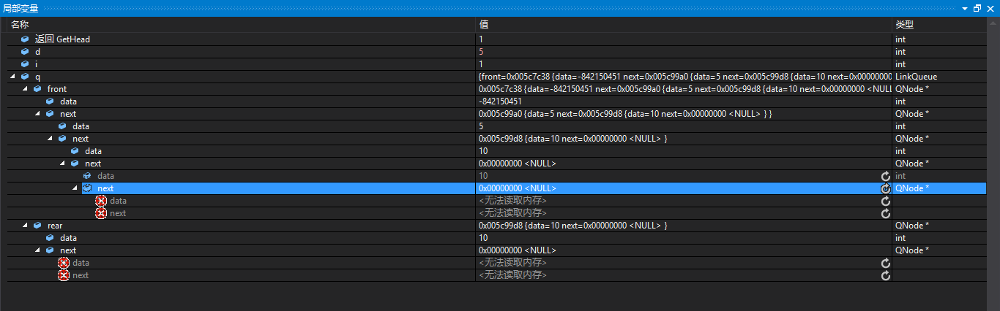

## 8. ##
按下1次F10，执行了下列程序语句：

	ClearQueue(&q);

函数的原型如下：

    /* 将Q清为空队列 */
    Status ClearQueue(LinkQueue *Q) {
    	QueuePtr p, q;
    	Q->rear = Q->front;
    	p = Q->front->next;
    	Q->front->next = NULL;
    	while (p) {
    		q = p;
    		p = p->next;
    		free(q);
    	}
    	return OK;
    }

在“局部变量”窗口中查看到的信息如下：

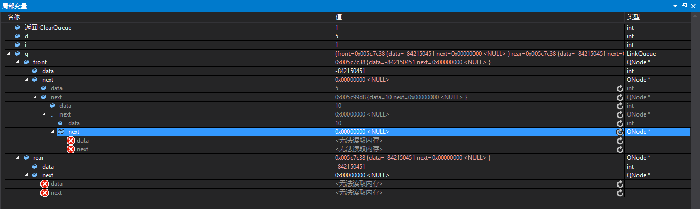

## 9. ##
按下1次F10之后，执行的程序语句如下：

	printf("清空队列后,q.front=%u q.rear=%u q.front->next=%u\n", q.front, q.rear, q.front->next);

“局部变量”窗口中就没有什么值得看的信息了，在CMD窗口中输出信息，值得看看。

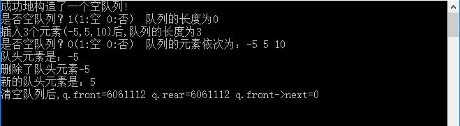

## 10. ##
按下1次F10，执行了程序语句如下：

	DestroyQueue(&q);

函数的原型如下：

    /* 销毁队列Q */
    Status DestroyQueue(LinkQueue *Q) {
    	while (Q->front) {
    		Q->rear = Q->front->next;
    		free(Q->front);
    		Q->front = Q->rear;
    	}
    	return OK;
    }

销毁队列的方法是释放队列的结点，这个在"局部变量"窗口中查看到提示信息:

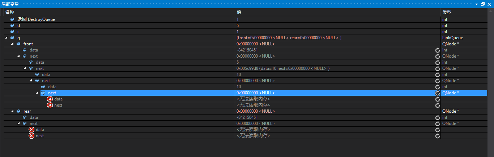

## 11. ##
按下1次F10，执行的程序语句如下：

	printf("销毁队列后,q.front=%u q.rear=%u\n", q.front, q.rear);

“局部变量”窗口中没有什么重要的提示信息，在CMD窗口中有重要的提示：

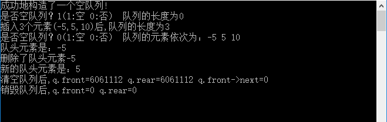

# 总结 #
## 1. ##
1个小的警告，问题不大。

    d:\visual studio code\链队列\链队列\linkqueue.c(160): warning C4477: 'printf' : format string '%u' requires an argument of type 'unsigned int', but variadic argument 1 has type 'QueuePtr'

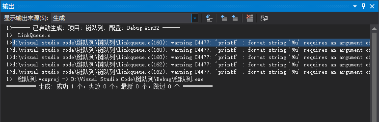

学会了一个新的技能，“%u”表示“unsigned”的格式。

## 2. ##
简单地说明一下，这个程序看似我已经分析完全了，但是核心的我却没有什么体会

