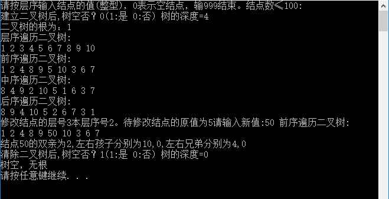
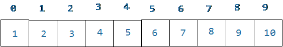
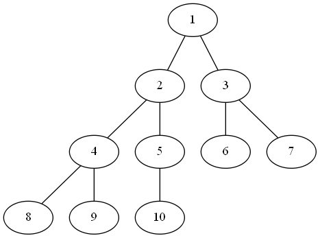

# 运行结果 #

# 调试信息 #
## 1. ##

## 2. ##

# 总结 #
## 1. ##
二叉树顺序存储结构的实现，代码比较长，调用的函数比较多，比较复杂。但是，就这里的程序，肯定多看看，就记住了调用关系，别想复杂的。

对于树的代码的研读，比较复杂的就是树的结构体，比前面见到的数据结构要复杂。

## 2. ##
数据1~10存储在数组0~9之中，数据在内存中的存储结构如下：

去看程序源码，我们知道这里是用满二叉树且用的数组顺序存储结构。二叉树的结构图如下：

验证

