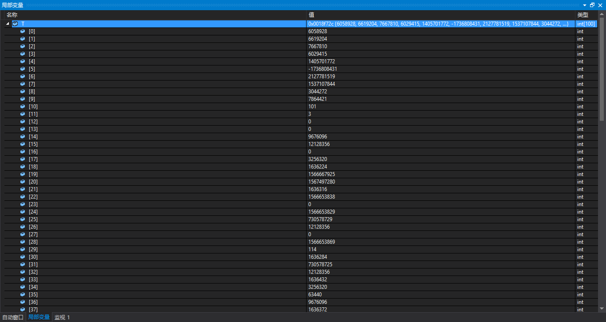
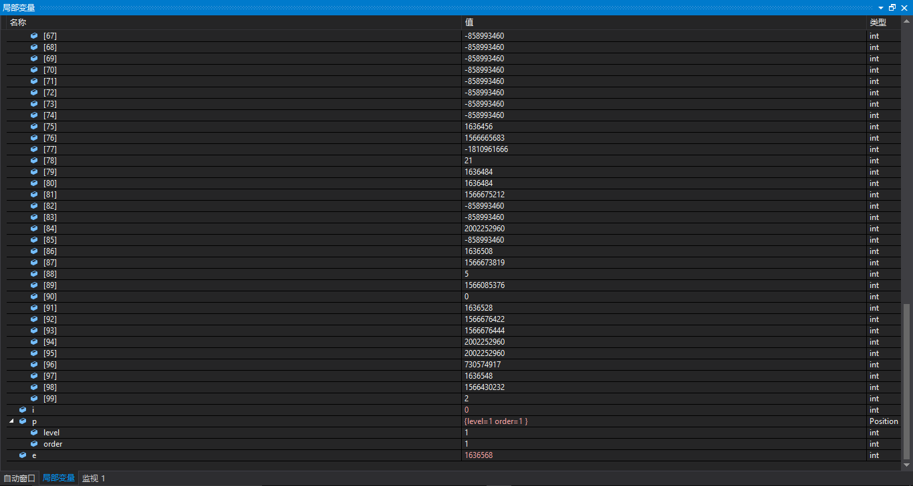
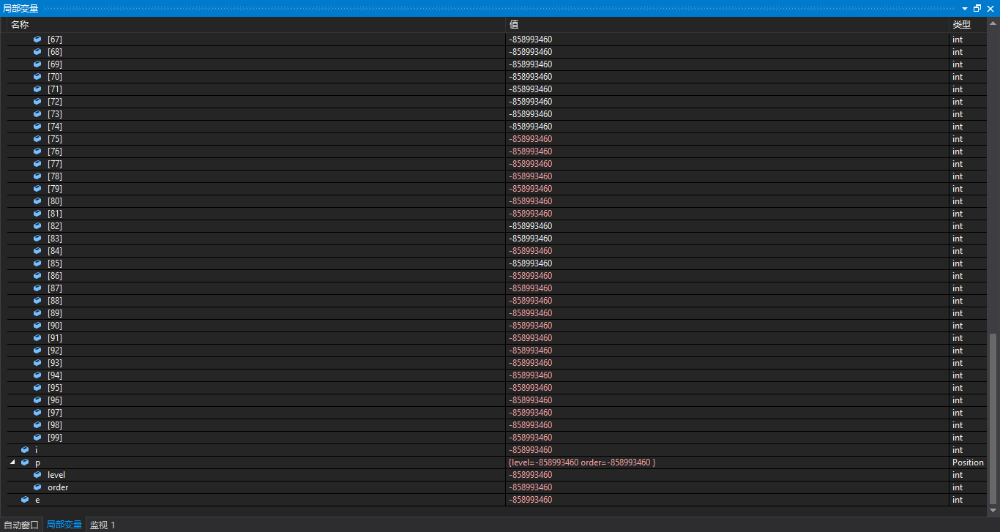
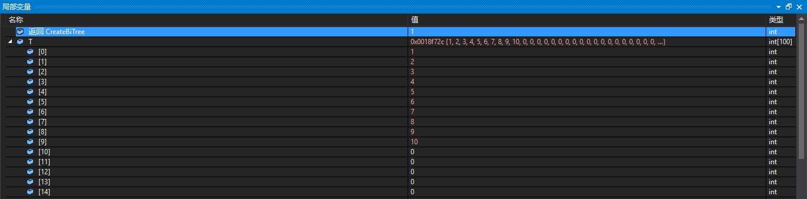
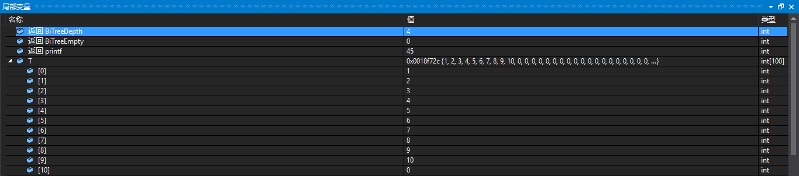
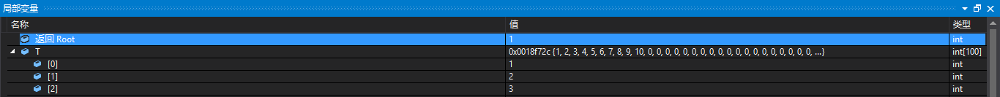
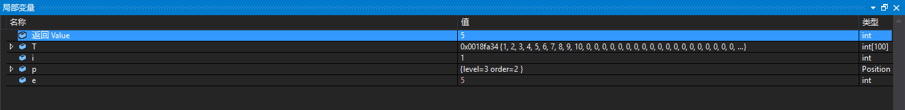
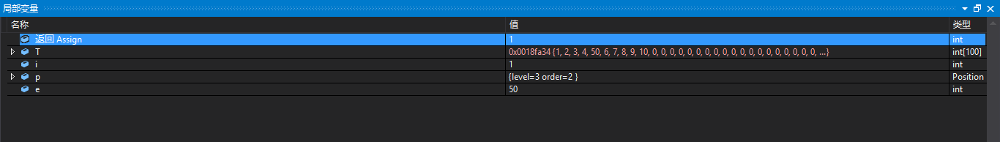
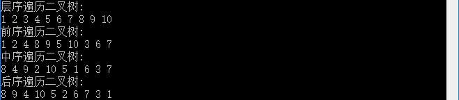

# 运行结果 #

# 调试信息 #
## 1. ##
按下1次F10，程序没有初始化任何变量，和以前的理解程序一样，看结果来:

## 2. ##
按下1次F10，运行以下的程序：

    int main() {
    	Status i;
    	Position p;
    	TElemType e;
    	SqBiTree T;

在“局部变量”窗口中可以看到的是:所有的变量都被赋一样的初值

## 3. ##
按下F10，运行以下的函数：

	InitBiTree(T);

函数的原型如下：

    /* 构造空二叉树T。因为T是固定数组，不会改变，故不需要& */
    Status InitBiTree(SqBiTree T) {
    	int i;
    	for (i = 0; i<MAX_TREE_SIZE; i++)
    		T[i] = Nil; /* 初值为空 */
    	return OK;
    }

可以看到“局部变量”窗口中，T数组全部被赋初值0

## 4. ##
按下F10，运行以下的函数;

	CreateBiTree(T);

函数的作用是，构造顺序满二叉树，函数的原型是：

    /* 按层序次序输入二叉树中结点的值(字符型或整型), 构造顺序存储的二叉树T */
    Status CreateBiTree(SqBiTree T) {
    	int i = 0;
    	/* 这里的程序，有点问题吧？说是输入，但是没有scanf函数 */
    	printf("请按层序输入结点的值(整型)，0表示空结点，输999结束。结点数≤%d:\n", MAX_TREE_SIZE);
    	//数组下标为0~9的元素依次为1~10
    	while (i<10) {
    		T[i] = i + 1;
    
    		if (i != 0 && T[(i + 1) / 2 - 1] == Nil&&T[i] != Nil) /* 此结点(不空)无双亲且不是根 */
    		{
    			printf("出现无双亲的非根结点%d\n", T[i]);
    			exit(ERROR);
    		}
    		i++;
    	}
    	//可以看到数组中在0~9之后的元素全是0
    	while (i<MAX_TREE_SIZE) {
    		T[i] = Nil; /* 将空赋值给T的后面的结点 */
    		i++;
    	}
    
    	return OK;
    }

可以看到“局部变量”窗口中的结果是：

## 5. ##
按下F10，执行以下程序语句：

	printf("建立二叉树后,树空否？%d(1:是 0:否) 树的深度=%d\n", BiTreeEmpty(T), BiTreeDepth(T));

可以看到在“局部变量”窗口中返回其值，结果如下：

## 6. ##
按下F10，执行的程序语句如下：

    i = Root(T, &e);

函数的作用是取二叉树的根，函数的原型如下：

    /* 初始条件: 二叉树T存在 */
    /* 操作结果:  当T不空,用e返回T的根,返回OK;否则返回ERROR,e无定义 */
    Status Root(SqBiTree T, TElemType *e) {
    	if (BiTreeEmpty(T)) /* T空 */
    		return ERROR;
    	else {
    		*e = T[0];
    		return OK;
    	}
    }

可以看到上面取二叉树的根的方法非常简单，就是取数组T的0下标元素。

## 7. ##
按下F10，执行的程序如下：

	printf("层序遍历二叉树:\n");
	LevelOrderTraverse(T);

上面的函数的原型如下：

    /* 层序遍历二叉树 */
    void LevelOrderTraverse(SqBiTree T) {
    	int i = MAX_TREE_SIZE - 1, j;
    	while (T[i] == Nil)
    		i--; /* 找到最后一个非空结点的序号 */
    	for (j = 0; j <= i; j++)  /* 从根结点起,按层序遍历二叉树 */
    		if (T[j] != Nil)
    			visit(T[j]); /* 只遍历非空的结点 */
    	printf("\n");
    }

上面的程序也写得太简单了吧，就是顺序输出数组中的元素。在“局部变量”窗口中是没有什么输出的，主要在CMD窗口中输出结果，可以猜到，不提。

## 8. ##
按下F10,执行的程序如下：

	printf("前序遍历二叉树:\n");
	PreOrderTraverse(T);

函数的原型如下：

    /* 初始条件: 二叉树存在 */
    /* 操作结果: 先序遍历T。 */
    Status PreOrderTraverse(SqBiTree T) {
    	if (!BiTreeEmpty(T)) /* 树不空 */
    		PreTraverse(T, 0);
    	printf("\n");
    	return OK;
    }

其中调用了函数PreTraverse(T, 0)，其函数的原型如下：

    /* PreOrderTraverse()调用 */
    void PreTraverse(SqBiTree T, int e) {
    	visit(T[e]);
    	if (T[2 * e + 1] != Nil) /* 左子树不空 */
    		PreTraverse(T, 2 * e + 1);
    	if (T[2 * e + 2] != Nil) /* 右子树不空 */
    		PreTraverse(T, 2 * e + 2);
    }

上面的程序用到了递归。

## 9. ##
按下F10，执行的程序语句如下:

	printf("中序遍历二叉树:\n");
	InOrderTraverse(T);

函数的原型如下:

    /* 初始条件: 二叉树存在 */
    /* 操作结果: 中序遍历T。 */
    Status InOrderTraverse(SqBiTree T) {
    	if (!BiTreeEmpty(T)) /* 树不空 */
    		InTraverse(T, 0);
    	printf("\n");
    	return OK;
    }

其在函数中用到了这个函数：InTraverse(T, 0)，其函数的原型如下：

    /* InOrderTraverse()调用 */
    void InTraverse(SqBiTree T, int e) {
    	if (T[2 * e + 1] != Nil) /* 左子树不空 */
    		InTraverse(T, 2 * e + 1);
    	visit(T[e]);
    	if (T[2 * e + 2] != Nil) /* 右子树不空 */
    		InTraverse(T, 2 * e + 2);
    }

## 10. ##
按下F10，执行的程序语句如下：

	printf("后序遍历二叉树:\n");
	PostOrderTraverse(T);

其函数的原型如下：

    /* 初始条件: 二叉树T存在 */
    /* 操作结果: 后序遍历T。 */
    Status PostOrderTraverse(SqBiTree T) {
    	if (!BiTreeEmpty(T)) /* 树不空 */
    		PostTraverse(T, 0);
    	printf("\n");
    	return OK;
    }

其在函数中调用了这个函数PostTraverse(T, 0)，函数的原型如下：

    /* PostOrderTraverse()调用 */
    void PostTraverse(SqBiTree T, int e) {
    	if (T[2 * e + 1] != Nil) /* 左子树不空 */
    		PostTraverse(T, 2 * e + 1);
    	if (T[2 * e + 2] != Nil) /* 右子树不空 */
    		PostTraverse(T, 2 * e + 2);
    	visit(T[e]);
    }
明显地用到了递归。

## 11. ##
按下F10，运行的程序如下：

	printf("修改结点的层号3本层序号2。");
	p.level = 3;
	p.order = 2;
	e = Value(T, p);

我自己猜这个元素就是5，也就是e的值是5。验证了自己的猜想。

## 12. ##
按下F10，执行下列的程序语句：

	printf("待修改结点的原值为%d请输入新值:50 ", e);
	e = 50;
	Assign(T, p, e);

没有让自己输入，系统默认输入的是50.

## 13. ##
在后面执行的程序就是：

    	printf("结点%d的双亲为%d,左右孩子分别为", e, Parent(T, e));
    	printf("%d,%d,左右兄弟分别为", LeftChild(T, e), RightChild(T, e));
    	printf("%d,%d\n", LeftSibling(T, e), RightSibling(T, e));
    	ClearBiTree(T);

----------

没有什么新意了，也没有什么难度了

# 总结 #
## 1. ##
二叉树顺序存储结构的实现，代码比较长，调用的函数比较多，比较复杂。但是，就这里的程序，肯定多看看，就记住了调用关系，别想复杂的。

对于树的代码的研读，比较复杂的就是树的结构体，比前面见到的数据结构要复杂。

## 2. ##
数据1~10存储在数组0~9之中，数据在内存中的存储结构如下：

去看程序源码，我们知道这里是用满二叉树且用的数组顺序存储结构。二叉树的结构图如下：

验证上面的图的话，就是根据先序、中序、后序和层次遍历的结果。

> 有了上面的基础，理解程序一定会变得更加容易了。