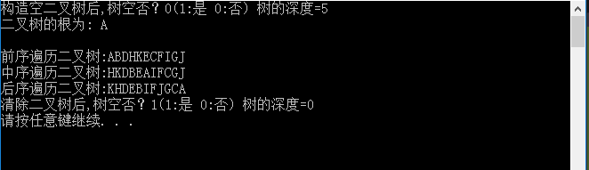
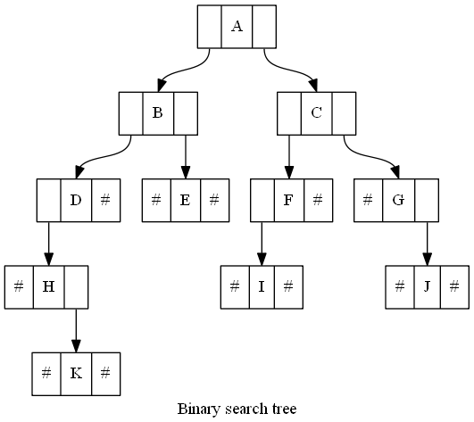

# 运行结果 #

# 调试信息 #
## 1. ##
按下F10，在程序还没有申明变量之前，编辑器为程序中的变量分配的内存情况，在“局部变量”窗口中反馈如下：

## 2. ##
按下F10，执行了以下程序：

    int main() {
    	int i;
    	BiTree T;
    	TElemType e1;

在“局部变量”窗口中显示的结果如下：

## 3. ##
按下F10，执行下面的程序，建立二叉树的链式存储结构：

	StrAssign(str, "ABDH#K###E##CFI###G#J##");

	CreateBiTree(&T);

可以看到在“局部变量”窗口中反馈的信息如下：（窗口只是部分的）

## 4. ##
按下F10，执行下列的程序：

	printf("构造空二叉树后,树空否？%d(1:是 0:否) 树的深度=%d\n", BiTreeEmpty(T), BiTreeDepth(T));
	e1 = Root(T);
	printf("二叉树的根为: %c\n", e1);

不是特别的复杂的代码，在“局部变量”窗口中反馈的信息如下：

## 5. ##
按下F10，执行下面的程序：

	printf("\n前序遍历二叉树:");
	PreOrderTraverse(T);
	printf("\n中序遍历二叉树:");
	InOrderTraverse(T);
	printf("\n后序遍历二叉树:");
	PostOrderTraverse(T);

上面的程序是遍历，主要看CMD窗口如下：

## 6. ##
按下F10，执行下面的程序：

     ClearBiTree(&T);
     printf("\n清除二叉树后,树空否？%d(1:是 0:否) 树的深度=%d\n", BiTreeEmpty(T), BiTreeDepth(T));
     i = Root(T);
     if (!i)
     printf("树空，无根\n");

上面的程序，不是特别复杂的，可以在程序中自己看。

# 总结 #
## 1. ##
首先第一点，就是画出二叉树的结构图，才能更好地去理解程序。采用的是二叉树的链式存储结果（这个二叉树的概念的理解，我是从王道考研数据结构书上看到的）

分析“局部变量”窗口中的内存信息，可以得到二叉树的结构如下：

可以用上面的前序、中序、后序遍历序列，来验证所得到的图，是否正确。

这个二叉树的生成语句如下：

	StrAssign(str, "ABDH#K###E##CFI###G#J##");

	CreateBiTree(&T);

由上面的字母序列：ABDH#K###E##CFI###G#J##，可知大约是按照前序的序列生成的二叉树。

函数的原型如下：（清晰明了）

    /* 按前序输入二叉树中结点的值（一个字符） */
    /* #表示空树，构造二叉链表表示二叉树T。 */
    void CreateBiTree(BiTree *T) {
    	TElemType ch;
    
    	/* scanf("%c",&ch); */
    	ch = str[index++];
    
    	if (ch == '#')
    		*T = NULL;
    	else {
    		*T = (BiTree)malloc(sizeof(BiTNode));
    		if (!*T)
    			exit(OVERFLOW);
    		(*T)->data = ch; /* 生成根结点 */
    		CreateBiTree(&(*T)->lchild); /* 构造左子树 */
    		CreateBiTree(&(*T)->rchild); /* 构造右子树 */
    	}
    }

## 2. ##
补充一点，如何销毁一颗链式存储结构的二叉树，函数原型如下：

    /* 初始条件: 二叉树T存在。操作结果: 销毁二叉树T */
    void DestroyBiTree(BiTree *T) {
    	if (*T) {
    		if ((*T)->lchild) /* 有左孩子 */
    			DestroyBiTree(&(*T)->lchild); /* 销毁左孩子子树 */
    		if ((*T)->rchild) /* 有右孩子 */
    			DestroyBiTree(&(*T)->rchild); /* 销毁右孩子子树 */
    		free(*T); /* 释放根结点 */
    		*T = NULL; /* 空指针赋0 */
    	}
    }

在源程序中，用了另外的一个名称宏定义销毁二叉树的函数名

    #define ClearBiTree DestroyBiTree

>在C语言中，malloc是根据量动态地建立结点，free是根据量动态地释放结点。

