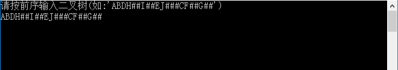

# 运行结果 #
这个程序是需要自己输入二叉树的节点值的。

比如我就输入“ABDH##I##EJ###CF##G##”，在CMD中显示的结果是:

# 调试信息 #
## 1. ##
按下F10，编辑器自动为变量申请的空间，没有初始化，运行以下的程序:

## 2. ##
按下F10,执行下面的程序语句：

    int main() {
    	BiThrTree H, T;

在“局部变量”窗口中看到的信息如下：

## 3. ##
按下F10，执行下面的程序的语句：

    CreateBiThrTree(&T); /* 按前序产生二叉树 */

同时，CMD窗口中提示输入值、效果如下：

在内存中建立了二叉树，可以在"局部变量"窗口中看到的提示信息如下:

## 4. ##
按下F10，执行了下面的程序语句：

    InOrderThreading(&H, T); /* 中序遍历,并中序线索化二叉树 */

函数的原型如下：

    /* 中序遍历二叉树T,并将其中序线索化,Thrt指向头结点 */
    Status InOrderThreading(BiThrTree *Thrt, BiThrTree T) {
    	*Thrt = (BiThrTree)malloc(sizeof(BiThrNode));
    	if (!*Thrt)
    		exit(OVERFLOW);
    	(*Thrt)->LTag = Link; /* 建头结点 */
    	(*Thrt)->RTag = Thread;
    	(*Thrt)->rchild = (*Thrt); /* 右指针回指 */
    	if (!T) /* 若二叉树空,则左指针回指 */
    		(*Thrt)->lchild = *Thrt;
    	else {
    		(*Thrt)->lchild = T;
    		pre = (*Thrt);
    		InThreading(T); /* 中序遍历进行中序线索化 */
    		pre->rchild = *Thrt;
    		pre->RTag = Thread; /* 最后一个结点线索化 */
    		(*Thrt)->rchild = pre;
    	}
    	return OK;
    }

在“局部变量”窗口中看到的提示信息如下：

----------

>电脑屏幕太“短”了，好想要这样竖屏的电脑屏幕：

## 5. ##
按下F10，执行了下面的语句：

	InOrderTraverse_Thr(H); /* 中序遍历(输出)二叉线索树 */

函数的原型如下：

    /* 中序遍历二叉线索树T(头结点)的非递归算法 */
    Status InOrderTraverse_Thr(BiThrTree T) {
    	BiThrTree p;
    	p = T->lchild; /* p指向根结点 */
    	while (p != T) { /* 空树或遍历结束时,p==T */
    		while (p->LTag == Link)
    			p = p->lchild;
    		if (!visit(p->data)) /* 访问其左子树为空的结点 */
    			return ERROR;
    		while (p->RTag == Thread&&p->rchild != T) {
    			p = p->rchild;
    			visit(p->data); /* 访问后继结点 */
    		}
    		p = p->rchild;
    	}
    	return OK;
    }

在“局部变量”中只能看到这个函数的返回值，结果如下：

----------

至此，程序算是结束了。

# 总结 #

这个程序有两个难点，1，二叉树的线索化；2，线索二叉树的中序遍历。
