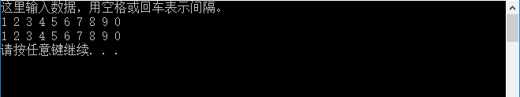

# 运行结果 #

这个程序我暂时搞不定，我要放一放！！

这个程序我暂时搞不定，我要放一放！！

这个程序我暂时搞不定，我要放一放！！

# 调试信息 #

# 总结 #
## 1. ##
邻接矩阵，这里的程序自己没有理解，主要在于，我没有将图画出来。没有图形，是很难理解的。

## 2. ##
关于C语言程序的理解，我在这里有个bug，纠正了过来。

    scanf_s("%d,%d",&a,&b,sizeof(a));

这里输入数据，有没有注意到，“%d”之间有个逗号","，在输入数据的时候，也要用逗号间隔哦，否则会报错。就像这样输入：

    请输入数据：
    5,6

## 3. ##
在数组数据输入的时候，我又犯了迷糊，看来我的基础不是很踏实啊。我写了个测试程序，帮助自己去理解。

    #include "stdio.h"
    #include "stdlib.h"

    int main() {
    	int a[10];
    	int i;
    	//输入数据
    	printf("这里输入数据，用空格或回车表示间隔。\n");
    	for (i = 0; i < 10; i++)
    		scanf_s("%d",&a[i]);
    
    	//输出数据
    	for (i = 0; i < 10; i++)
    		printf("%d ", a[i]);
    	prinf("\n");
    	system("pause");
    	return 0;
    }

在CMD窗口中输入数据的效果如下:

