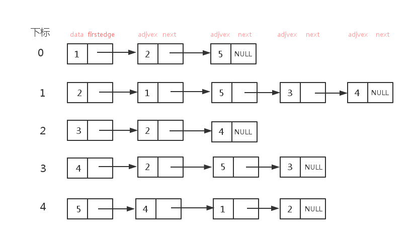

# 运行结果 #
## 1.

这里的图的结构，我用的就是上一个程序-邻接矩阵的图的结构。但是是有不同的，在邻接表这里图的结构是有方向的。

### 图的结构:


### 图的邻接表结构：



如果结合在“局部变量”中的信息，很快就会明白了。

我将原来程序的代码段稍微修改了一下：

```
		e = (EdgeNode *)malloc(sizeof(EdgeNode)); /* 向内存申请空间,生成边表结点 */
		e->adjvex = j;					/* 邻接序号为j */
		e->next = G->adjList[i-1].firstedge;	/* 将e的指针指向当前顶点上指向的结点 */
		G->adjList[i-1].firstedge = e;		/* 将当前顶点的指针指向e */

		e = (EdgeNode *)malloc(sizeof(EdgeNode)); /* 向内存申请空间,生成边表结点 */
		e->adjvex = i;					/* 邻接序号为i */
		e->next = G->adjList[j-1].firstedge;	/* 将e的指针指向当前顶点上指向的结点 */
		G->adjList[j-1].firstedge = e;		/* 将当前顶点的指针指向e */
```

现在试了试，可以了。

### 局部变量窗口中的信息:

由下面三张图显示在“内存”中的信息没有什么错误，可喜可贺。


### CMD窗口中显示的信息:


## 2.

我发现原来的程序，用一个测试例子不太行，我又来增加一个例子。

### 图的结点结构：


### 图的邻接表存储结果：


### CMD窗口中显示的信息:


### “局部变量”窗口中显示的信息：


## 3.

再增加一个图的结构，作为测试：

### 图的结点结构：


### 图的邻接表存储结构：


### CMD窗口中显示的信息：


### “局部变量”窗口中显示的信息：


> 由上面运行结果的1，2，3可知，为什么我们运行结果的1跑不通了。因为插入的数据下标根本不是从下标为0的存储区域开始的。这是导致错误原因的所在。我的最大顶点数量**“#define MAXVEX 5 /* 最大顶点数,应由用户定义 */”**就是这么定义的。导致存储区域小了，数据元素插不进去，自然不行了。

# 调试信息 #

调试信息显得没有什么可以讲的了，从上面的“运行结果”可窥一二。

# 总结 #

## 1. ##
我在输入数据进行运行结果测试的时候，总是出现循环输入的错误。按F10太粗犷了，看得不细。我在键盘输入F11，可以看清每输入一个数据的“局部变量”内存的变化。


>从上面的图可以看清变化，原来下标为0的地址单元中存放的是1元素，我输入1，2，可以仔细地看上面的图，没想到在这里出错了，看程序思考问题所在。

后来解决这个问题就是从数组的下标入手。

原来的程序段:

```
		e = (EdgeNode *)malloc(sizeof(EdgeNode)); /* 向内存申请空间,生成边表结点 */
		e->adjvex = j;					/* 邻接序号为j */
		e->next = G->adjList[i].firstedge;	/* 将e的指针指向当前顶点上指向的结点 */
		G->adjList[i].firstedge = e;		/* 将当前顶点的指针指向e */

		e = (EdgeNode *)malloc(sizeof(EdgeNode)); /* 向内存申请空间,生成边表结点 */
		e->adjvex = i;					/* 邻接序号为i */
		e->next = G->adjList[j].firstedge;	/* 将e的指针指向当前顶点上指向的结点 */
		G->adjList[j].firstedge = e;		/* 将当前顶点的指针指向e */
```

修改后的代码段：

```
		e = (EdgeNode *)malloc(sizeof(EdgeNode)); /* 向内存申请空间,生成边表结点 */
		e->adjvex = j;					/* 邻接序号为j */
		e->next = G->adjList[i-1].firstedge;	/* 将e的指针指向当前顶点上指向的结点 */
		G->adjList[i-1].firstedge = e;		/* 将当前顶点的指针指向e */

		e = (EdgeNode *)malloc(sizeof(EdgeNode)); /* 向内存申请空间,生成边表结点 */
		e->adjvex = i;					/* 邻接序号为i */
		e->next = G->adjList[j-1].firstedge;	/* 将e的指针指向当前顶点上指向的结点 */
		G->adjList[j-1].firstedge = e;		/* 将当前顶点的指针指向e */
```

对比就可以知道，哪里修改了。