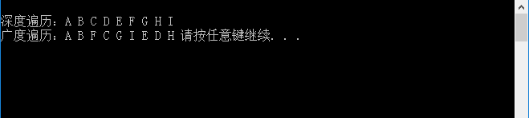

# 运行结果

CMD界面截图如下：



上面的图的结构是在系统中自己构建的。

# 调试信息

## 1.

按下1次F10，编辑器为程序申明的变量空间，在“局部变量”窗口中显示如下：


## 2.

按下1次F10，执行的程序如下：

```
	int main(void) {
	MGraph G;
```

上面的语句的作用是，申明变量：

```
typedef struct {
	VertexType vexs[MAXVEX]; /* 顶点表 */
	EdgeType arc[MAXVEX][MAXVEX];/* 邻接矩阵，可看作边表 */
	int numVertexes, numEdges; /* 图中当前的顶点数和边数 */
}MGraph;
```

在“局部变量”窗口中显示的信息如下：


## 3.

按下F10，执行的程序语句如下：

```
	CreateMGraph(&G);
```

该函数的原型是：

```
void CreateMGraph(MGraph *G) {
	int i, j;

	G->numEdges = 15;
	G->numVertexes = 9;

	/* 读入顶点信息，建立顶点表 */
	G->vexs[0] = 'A';
	G->vexs[1] = 'B';
	G->vexs[2] = 'C';
	G->vexs[3] = 'D';
	G->vexs[4] = 'E';
	G->vexs[5] = 'F';
	G->vexs[6] = 'G';
	G->vexs[7] = 'H';
	G->vexs[8] = 'I';


	for (i = 0; i < G->numVertexes; i++)/* 初始化图 */
	{
		for (j = 0; j < G->numVertexes; j++) {
			G->arc[i][j] = 0;
		}
	}

	G->arc[0][1] = 1;
	G->arc[0][5] = 1;

	G->arc[1][2] = 1;
	G->arc[1][8] = 1;
	G->arc[1][6] = 1;

	G->arc[2][3] = 1;
	G->arc[2][8] = 1;

	G->arc[3][4] = 1;
	G->arc[3][7] = 1;
	G->arc[3][6] = 1;
	G->arc[3][8] = 1;

	G->arc[4][5] = 1;
	G->arc[4][7] = 1;

	G->arc[5][6] = 1;

	G->arc[6][7] = 1;


	for (i = 0; i < G->numVertexes; i++) {
		for (j = i; j < G->numVertexes; j++) {
			G->arc[j][i] = G->arc[i][j];
		}
	}

}
```

在“局部变量”窗口中显示的结果是：


## 4.

按下F10，这里执行的程序语句是：

```
	DFSTraverse(G);
```

该函数的原型是：

```
/* 邻接矩阵的深度遍历操作 */
void DFSTraverse(MGraph G) {
	int i;
	for (i = 0; i < G.numVertexes; i++)
		visited[i] = FALSE; /* 初始所有顶点状态都是未访问过状态 */
	for (i = 0; i < G.numVertexes; i++)
		if (!visited[i]) /* 对未访问过的顶点调用DFS，若是连通图，只会执行一次 */
			DFS(G, i);
}
```

说实话，这里按F10，单步调试是没有什么结果可看的，在“局部变量”窗口中是没有信息可看的。只有按下“F11”单个语句去调试，才能看出内存中的信息是如何变化的。

简单点，在“CMD窗口”中可以看到的信息如下：


## 5.

按下F10，单步执行下面的语句：

```
	BFSTraverse(G);
```

在“局部变量”窗口中是没有看到什么有价值的信息，该函数的原型是：

```
/* 邻接矩阵的广度遍历算法 */
void BFSTraverse(MGraph G) {
	int i, j;
	Queue Q;
	for (i = 0; i < G.numVertexes; i++)
		visited[i] = FALSE;
	InitQueue(&Q);		/* 初始化一辅助用的队列 */
	for (i = 0; i < G.numVertexes; i++)  /* 对每一个顶点做循环 */
	{
		if (!visited[i])	/* 若是未访问过就处理 */
		{
			visited[i] = TRUE;		/* 设置当前顶点访问过 */
			printf("%c ", G.vexs[i]);/* 打印顶点，也可以其它操作 */
			EnQueue(&Q, i);		/* 将此顶点入队列 */
			while (!QueueEmpty(Q))	/* 若当前队列不为空 */
			{
				DeQueue(&Q, &i);	/* 将队对元素出队列，赋值给i */
				for (j = 0; j<G.numVertexes; j++) {
					/* 判断其它顶点若与当前顶点存在边且未访问过  */
					if (G.arc[i][j] == 1 && !visited[j]) {
						visited[j] = TRUE;			/* 将找到的此顶点标记为已访问 */
						printf("%c ", G.vexs[j]);	/* 打印顶点 */
						EnQueue(&Q, j);				/* 将找到的此顶点入队列  */
					}
				}
			}
		}
	}
}
```

在“CMD窗口”中显示的信息如下：


# 总结

没有什么总结的，这里多去看看书本，说明都在书上。先建立图的结构，按照深度和广度的遍历算法去遍历就可以了。


