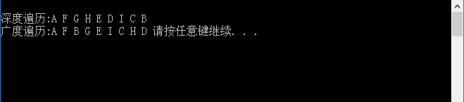

# 运行结果



# 调试信息

```
int main(void) {
	MGraph G;
	GraphAdjList GL;
	CreateMGraph(&G);
	CreateALGraph(G, &GL);

	printf("\n深度遍历:");
	DFSTraverse(GL);
	printf("\n广度遍历:");
	BFSTraverse(GL);

	system("pause");
	return 0;
}
```

看看main函数中的内容，就知道F10调试没有什么有价值的内容显示。

# 总结

